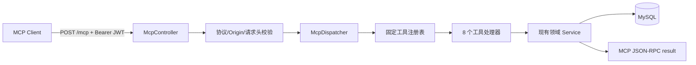

# LINEAR-LITE-78：MCP 服务技术方案

## 1. 方案结论

在现有 `linear-lite-server` 中新增一个基于 Spring MVC 的 MCP 协议适配层，提供唯一入口 `POST /mcp`，严格实现 MCP `2026-07-28` 规范，只暴露项目、任务、评论和文档相关的 8 个工具。

协议层只负责 JSON-RPC 解析、规范校验、工具发现、认证上下文传递和结果封装；业务执行全部复用现有领域服务，不新增一套项目、任务或文档业务逻辑，也不新增数据库表。

不采用 `2025-11-25` 及更早版本的 MCP 兼容路径：不实现 `initialize` / `notifications/initialized`、`Mcp-Session-Id`、HTTP GET SSE 独立通道、HTTP DELETE 会话关闭和旧 HTTP+SSE 传输。

## 2. 规范与技术选型

### 2.1 目标规范

目标协议版本固定为 `2026-07-28`。该版本已正式发布，核心变化是协议无状态化：每个请求自带协议版本、客户端能力和客户端信息，不依赖连接或历史请求；服务端能力发现使用 `server/discover`。

传输采用新 Streamable HTTP：所有消息都是发往单一 MCP endpoint 的独立 POST，请求响应使用单个 JSON 对象即可满足本期同步工具场景。工具调用不引入长任务和服务端主动交互，因此不实现 SSE 响应流、`subscriptions/listen` 或 Tasks 扩展。

官方 Java SDK 当前最新稳定版本 `2.0.0` 仍跟踪 `2025-11-25`，其会话和初始化模型与本任务要求的 `2026-07-28` 不一致。因此本项目不引入该 SDK 作为协议核心，直接使用现有 Spring Boot、Jackson 和 Servlet 能力实现协议适配层，避免引入旧规范行为或隐式兼容分支。

### 2.2 规范约束

- `POST /mcp` 是唯一 MCP endpoint；`GET /mcp`、`DELETE /mcp` 直接返回 `405 Method Not Allowed`。
- 每个请求必须带 `MCP-Protocol-Version: 2026-07-28`。
- 请求体 `params._meta` 必须包含：
  - `io.modelcontextprotocol/protocolVersion`，且必须与 HTTP 头一致；
  - `io.modelcontextprotocol/clientCapabilities`；
  - `io.modelcontextprotocol/clientInfo` 可选，但客户端应提供。
- 每个 POST 必须带 `Mcp-Method`，其值必须与 JSON-RPC `method` 一致。
- `tools/call` 必须额外带 `Mcp-Name`，其值必须与 `params.name` 一致。
- `server/discover`、`tools/list`、`tools/call` 以外的方法返回 JSON-RPC `-32601`；不支持的协议版本返回 `-32022`。
- 所有成功结果都包含 `resultType: "complete"`；工具业务失败仍返回 MCP 成功响应体中的 `isError: true`，不把业务异常伪装成协议层异常。
- `tools/list` 按固定顺序返回工具，并返回 `ttlMs`、`cacheScope: "private"`。使用 private 是因为入口要求携带用户身份，且未来工具集合可能随授权范围变化。
- 工具输入输出使用 JSON Schema 2020-12；输入 schema 关闭未声明字段，更新操作的清空字段与赋值字段在 schema 和服务端校验中保持互斥。

## 3. 整体架构



### 3.1 建议代码结构

新增以下模块，全部位于 `com.linearlite.server.mcp` 下：

- `McpController`：只接收 `/mcp` POST，读取 JSON-RPC 请求和规范要求的 HTTP 头。
- `McpRequestValidator`：校验 JSON-RPC 基本结构、`2026-07-28` 版本、`_meta`、标准请求头和 Origin。
- `McpDispatcher`：分发 `server/discover`、`tools/list`、`tools/call`，统一生成 JSON-RPC 响应。
- `McpToolRegistry`：保存固定、确定顺序的工具定义和对应处理器，不根据连接状态动态改变工具集合。
- `McpToolHandler`：工具处理器接口；每个工具处理器只做参数映射和结果转换。
- `McpJsonRpcRequest`、`McpJsonRpcResponse`、`McpError` 等协议 record：与既有 `ApiResponse` 分离，避免把 REST 响应包装泄露到 MCP wire format。
- `McpToolSchemas`：集中维护 8 个工具的输入、输出 schema 和工具说明。
- `McpExceptionMapper`：将业务异常转为 `isError: true` 的工具结果，并将协议异常转为 JSON-RPC error。

工具处理器不得调用 Controller，不得直接访问 Mapper，不得从工具参数读取 `creatorId`、`userId` 或其他权限主体字段。当前用户统一来自既有 JWT 过滤器注入的 `userId` 请求属性。

## 4. 工具定义

工具名称采用固定的 ASCII 小写下划线命名，工具返回的 `structuredContent` 为领域服务返回对象，同时在 `content[0].text` 中放置同一结果的 JSON 序列化文本，满足 MCP 结构化结果和文本结果的兼容要求。

| 工具 | 必填参数 | 可选参数 | 调用的现有服务 | 输出 |
|---|---|---|---|---|
| `list_projects` | 无 | 无 | `ProjectService.list` | `Project[]` |
| `create_project` | `name`, `identifier` | 无 | `ProjectService.create` | `Project` |
| `create_task` | `projectId`, `title` | `parentId`, `description`, `status`, `priority`, `assigneeId`, `dueDate`, `plannedStartDate`, `progressPercent`, `labels` | `TaskCommandService.create` | `TaskMutationResponse` |
| `update_task` | `taskKey` | `title`, `parentId`, `clearParent`, `description`, `status`, `priority`, `assigneeId`, `clearAssignee`, `dueDate`, `clearDueDate`, `plannedStartDate`, `clearPlannedStart`, `progressPercent`, `labels` | `TaskCommandService.update` | `TaskMutationResponse` |
| `add_task_comment` | `taskKey`, `body` | `parentId`, `mentionedUserIds` | `TaskCommentService.create` | `TaskCommentResponse` |
| `get_task` | `taskKey` | 无 | `TaskQueryService.getByKeyOrThrow` | `Task` |
| `create_document` | `projectId`, `title` | `parentDocumentId`, `content`, `externalSource`, `externalSourceId` | `ProjectDocumentCommandService.create` | `ProjectDocumentResponse` |
| `update_document` | `documentId`, `expectedVersion`, `title`, `content` | 无 | `ProjectDocumentCommandService.update` | `ProjectDocumentResponse` |

### 4.1 参数规则

- 任务 ID 统一使用对外任务标识 `taskKey`，例如 `ENG-1`；不另造数据库主键接口。
- `create_task.projectId` 使用现有项目数字 ID；创建任务的 `creatorId` 从认证用户取得。
- `update_task` 保留现有更新语义：`parentId` 与 `clearParent`、`assigneeId` 与 `clearAssignee`、`dueDate` 与 `clearDueDate`、`plannedStartDate` 与 `clearPlannedStart` 互斥；未传字段不变。
- `update_document.expectedVersion` 必填，直接复用文档乐观锁。版本冲突返回工具错误结果，并在结构化错误数据中带当前版本；不自动重读、不覆盖、不降级为无版本更新。
- `content` 继续使用项目现有 BlockNote JSON 字符串格式，不在 MCP 层转换为 Markdown 或其他格式。
- 不接受 `Authorization`、JWT、用户 ID、项目成员 ID 等权限控制字段作为工具业务参数，避免模型伪造调用身份。

## 5. 认证、权限与安全

### 5.1 认证

复用现有 JWT 认证实现：MCP 客户端在每个 POST 的 `Authorization` 头中携带 `Bearer <token>`，服务端解析 token 并注入 `JwtAuthFilter.REQUEST_ATTR_USER_ID`。需要调整 `JwtAuthFilter.shouldNotFilter`，使 `/mcp` 进入 JWT 校验范围；不得新增 query string token 或 Cookie token 路径。

本期将 MCP 作为 Linear Lite 的受保护资源，使用宿主系统已有 JWT 作为项目自有 authorization strategy，不在本任务内伪造一个 OAuth 授权服务器。若后续接入标准 OAuth 授权服务器，再按 MCP Authorization 规范补齐 Protected Resource Metadata、issuer discovery 和 Client ID Metadata Documents；当前不为不存在的授权服务器增加空配置或兼容分支。

### 5.2 请求防护

- 配置 `MCP_ALLOWED_ORIGINS`，Origin 存在但不在 allowlist 时返回 `403`；本地运行时绑定 `127.0.0.1`。
- 只信任请求体作为业务参数来源，同时严格校验 HTTP 镜像头和请求体一致，防止代理按头路由、应用按体执行产生安全分歧。
- 工具参数执行前进行类型、必填字段、长度、日期格式、数值范围和互斥字段校验。
- 日志只记录 JSON-RPC request id、工具名、认证用户 ID、客户端名称和耗时，不记录完整参数，避免泄露文档正文、评论内容和 JWT。
- 所有项目成员、项目创建者、任务访问和文档版本权限继续由现有 `ProjectAccessGuard`、`TaskPermissionGuard` 及领域服务执行；MCP 层不复制权限判断。

## 6. 请求与响应处理

### 6.1 请求流程

1. `McpController` 检查 HTTP 方法、Content-Type、Origin 和 Authorization。
2. `McpRequestValidator` 解析 JSON-RPC 2.0，拒绝空 id、批量数组、缺少 `_meta`、版本不一致和标准头不一致的请求。
3. `McpDispatcher` 根据 `method` 路由：
   - `server/discover`：返回支持版本、tools 能力、服务端信息和使用说明；
   - `tools/list`：返回固定工具目录；
   - `tools/call`：按工具名取处理器，校验 arguments 后执行。
4. 处理器只调用现有领域服务，并将返回对象转换为 `structuredContent`。
5. `server/discover` 在 `result.serverInfo` 顶层返回服务端名称和版本；`_meta` 只承载协议元数据，不承载发现结果字段。

### 6.2 错误边界

协议级错误使用 JSON-RPC error：

| 场景 | HTTP | JSON-RPC code |
|---|---:|---:|
| JSON 无法解析 / 请求结构非法 | 400 | `-32600` |
| 参数缺失、类型错误、版本不一致 | 400 | `-32602` |
| `Mcp-Method` / `Mcp-Name` 缺失或与 body 不一致 | 400 | `-32020` |
| 不支持的协议版本 | 400 | `-32022` |
| 未注册的 RPC 方法 | 404 | `-32601` |

工具执行中的资源不存在、无权限、字段业务校验失败、版本冲突等，返回：

```json
{
  "result": {
    "resultType": "complete",
    "isError": true,
    "content": [{"type": "text", "text": "业务错误信息"}],
    "structuredContent": {
      "errorType": "RESOURCE_NOT_FOUND",
      "message": "业务错误信息"
    }
  }
}
```

不返回 REST 的 `code/message/data` 外层，不把异常堆栈直接返回客户端。

## 7. 配置与部署

只新增 MCP 专用配置，不改写现有本地环境文件：

| 配置 | 作用 | 默认策略 |
|---|---|---|
| `MCP_ENABLED` | 是否注册 `/mcp` | `false`，部署时显式开启 |
| `MCP_ALLOWED_ORIGINS` | Origin allowlist | 生产环境必须显式配置 |
| `MCP_SERVER_NAME` | `serverInfo.name` | `linear-lite` |
| `MCP_SERVER_VERSION` | `serverInfo.version` | 应用版本 |
| `MCP_TOOL_LIST_TTL_MS` | 工具目录缓存时长 | `300000` |

启用后，MCP 与现有 REST API 共用 9080 端口和 JWT secret。反向代理只转发 `/mcp`，保留 `Authorization`、`MCP-Protocol-Version`、`Mcp-Method`、`Mcp-Name` 请求头，不配置旧 `/sse` 或 `/message` 路由。

## 8. 实施顺序

1. 建立 MCP 协议对象、请求校验、JSON-RPC 响应封装和 `/mcp` endpoint。
2. 接入 JWT、Origin allowlist 和标准 MCP 请求头校验，完成 `server/discover` 与 `tools/list`。
3. 接入项目、任务查询和任务变更工具，复用现有 DTO 和领域服务。
4. 接入评论和文档创建/更新工具，保留文档版本冲突语义。
5. 补充 MCP 开关、Origin、服务信息和工具目录缓存配置，更新服务运行说明。

## 9. 完成标准

- 新 MCP 客户端使用 `2026-07-28` 请求元数据和 Streamable HTTP POST，可完成 `server/discover`、`tools/list` 和 8 个工具调用。
- `tools/list` 始终以确定顺序返回 8 个工具及合法 JSON Schema 2020-12 定义。
- 创建、更新、查询、评论和文档操作都经过当前 JWT 用户对应的项目权限校验。
- 文档更新严格要求 `expectedVersion`，冲突可被客户端识别且不会覆盖他人修改。
- `/mcp` 不存在旧初始化握手、协议会话、旧 SSE endpoint、query token 和字段兼容回退逻辑。

## 10. 规范依据

- [MCP 2026-07-28 正式发布说明](https://blog.modelcontextprotocol.io/posts/2026-07-28/)
- [MCP 2026-07-28 基础协议](https://modelcontextprotocol.io/specification/2026-07-28/basic)
- [MCP 2026-07-28 Streamable HTTP](https://modelcontextprotocol.io/specification/2026-07-28/basic/transports/streamable-http)
- [MCP 2026-07-28 Tools](https://modelcontextprotocol.io/specification/2026-07-28/server/tools)
- [MCP 2026-07-28 Discovery](https://modelcontextprotocol.io/specification/2026-07-28/server/discover)
- [MCP 2026-07-28 Authorization](https://modelcontextprotocol.io/specification/2026-07-28/basic/authorization)
- [官方 Java SDK 发布页](https://github.com/modelcontextprotocol/java-sdk/releases)
