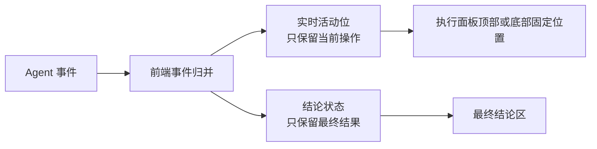

# Agent 执行面板 UI 优化方案

## 1. 方案结论

将任务详情中的 Agent 执行区域改造成“固定可视区域 + 单条实时活动 + 最终结论”的执行面板。

任务详情页只展示用户需要理解的结果，不再把工具调用、文件搜索、命令执行和工具返回逐条追加为历史日志。工具执行过程保留为实时状态，在同一个位置不断替换当前活动；Agent 最终回答、完成状态和失败信息进入结论区。

本方案只调整前端 UI 布局和事件展示模型，不改变任务执行、SSE 事件来源、执行结果持久化和任务业务状态。

## 2. 当前问题

当前最突出的问题是 Agent 事件持续追加后，内联任务详情页高度无限增长，最终把整个工作区撑成长页面。

问题表现为：

- 执行过程中不断增加“调用工具”“工具执行完成”和命令内容；
- 文件搜索、代码搜索、读取文件等内部步骤全部进入页面主体；
- 执行结束后，历史事件仍然保留，页面高度继续由完整事件内容决定；
- 用户需要在大量过程信息中寻找最终结论。

## 3. 根因定位

### 3.1 内联任务详情取消了高度约束

`TaskEditor.vue` 的内联模式存在以下组合：

- `.editor-panel--inline` 使用 `height: auto`、`max-height: none` 和 `overflow: visible`；
- `.editor-panel--inline .editor-body` 使用 `flex: 0 0 auto`；
- `.editor-panel--inline .editor-content-scroll` 使用 `flex: 0 0 auto` 和 `overflow: visible`；
- `BoardViewContent.vue` 的 `.board-content--inline-editor` 同样设置为 `overflow: visible`。

这套规则原本用于避免编辑器内部控件被裁切，但也同时取消了 Agent 布局所需要的确定高度。日志列表即使声明了 `overflow-y: auto`，父级没有确定高度时也无法形成真正的内部滚动区域，只能继续撑开页面。

### 3.2 固定高度只覆盖执行中状态

Agent 状态面板只在 `.agent-status-panel--active` 下设置固定高度。执行完成后，`isAgentExecutionActive` 变为 false，但 `shouldShowAgentPanel` 仍会因为已有事件继续保持面板显示，固定高度随之失效，完整历史事件重新参与页面高度计算。

### 3.3 事件展示模型与用户目标不匹配

当前事件流会生成并展示以下内容：

- assistant 的中间过程说明；
- 每一次工具调用；
- 每一次工具调用结果；
- 工具命令和大段返回内容；
- 文件搜索、代码搜索和读取文件等内部操作。

前端的 `renderedAgentEvents` 只对部分 skill 结果做了过滤，不能改变“所有工具事件进入列表”的整体模型。因此事件数量和单条内容长度都会持续累加。

### 3.4 刷新后错误恢复已完成执行面板

任务执行成功时，后端会将 Job 标记为 `succeeded`，并将最终结论写入评论。但刷新任务详情时，前端仍会读取最近一次执行的 `executionId` 和 `jobId`，随后无条件重建 SSE。

SSE 建立后会回放旧的工具事件，事件重新填入 `agentEvents`，而当前面板显示条件包含 `agentEvents.length > 0`。因此即使任务已经完成、结论已经在评论中，历史执行面板仍会被重新显示。

执行面板必须只代表“当前正在执行的过程”，不能因为存在历史事件而恢复。任务终态由 Job 状态判断，不能通过评论文本反向推断。

## 4. 目标交互模型



用户看到的结构固定为：

```text
任务内容                         | Pi 执行
                                 | 当前：正在搜索文件…
                                 | 状态：执行中
                                 |
                                 | 最终结论
```

## 5. 具体优化内容

### 5.1 恢复 Agent 布局的可视高度

仅当 Agent 执行面板出现时，为内联详情恢复独立的高度约束：

- 任务详情面板占据当前工作区可用高度；
- 任务详情主体使用 `flex: 1` 和 `min-height: 0`；
- 左侧任务正文保持自己的阅读滚动区域；
- 右侧 Agent 面板保持固定高度；
- Agent 面板内部不再依赖页面整体滚动；
- 执行完成后仍然保持同一高度模型，不能因 active 状态结束而退化为 auto 高度。

普通任务详情继续使用现有的页面纵向滚动，不改变没有 Agent 执行时的阅读体验。

### 5.2 将事件列表改为事件归并状态

不再通过 `v-for` 将全部 `agentEvents` 渲染成历史列表。前端只维护两个展示状态：

#### 实时活动 `liveActivity`

只保存当前正在发生的操作，新的工具事件到达后直接替换旧内容。

示例：

- `正在启动 Pi…`
- `正在搜索文件…`
- `正在读取文件…`
- `正在执行命令…`
- `正在整理结果…`

实时活动只显示语义化动作，不展示完整命令和原始工具输出。

#### 最终结论 `finalConclusion`

只保存用户最终需要阅读的内容：

- Agent 最终回答；
- 执行完成状态；
- 执行失败原因。

中间 assistant 说明只更新临时摘要，不逐条进入结论区。执行完成时，将最后一条有效 assistant 内容确认为最终结论。

### 5.3 固定事件展示规则

| 事件类型 | UI 行为 |
|---|---|
| `started` | 更新实时活动为“正在启动 Pi” |
| `progress` | 更新临时摘要，不追加历史项；完成时保留最后一条作为结论 |
| `tool_call` | 替换实时活动，按工具语义显示“正在搜索文件”“正在读取文件”等 |
| `tool_result` | 不创建历史项；成功时更新为下一阶段，失败时转为错误状态 |
| `completed` | 清空实时活动，展示最终结论和“执行完成” |
| `failed` | 清空实时活动，展示失败原因和明确的失败状态 |

工具调用、文件搜索和命令执行不再形成永久堆叠的日志卡片。

### 5.4 执行面板的视觉层级

遵循现有 Linear Lite 的安静工作台风格：

- 实时活动使用低干扰的次级文字、轻量 spinner 和单行布局；
- 执行中状态使用主强调色，失败状态使用语义红色；
- 最终结论使用正文层级，明显高于实时活动和时间信息；
- 不再为每个工具事件绘制独立卡片和边框；
- 不默认显示命令、路径和原始工具返回内容；
- 时间只作为辅助信息，不参与主要视觉层级；
- 状态不能只依赖颜色，同时使用文字和图标表达。

### 5.5 执行终态处理

执行面板只服务于当前执行过程。任务执行完成后，最终结论已经写入评论，执行面板应关闭，不再作为第二个结果展示入口。

终态处理规则固定如下：

1. `queued`、`leased`、`running`：显示执行面板并建立实时事件连接；
2. `succeeded`、`failed`、`canceled`：关闭事件连接、清空实时事件、不显示执行面板；
3. 收到 `completed` 或 `failed` 事件时，立即结束当前面板状态；
4. 刷新页面时，只有可执行状态允许重建 SSE；
5. 终态结论统一从评论区域读取，不在执行面板重复展示；
6. 面板显示条件只依赖当前 Job 是否处于可执行状态，不依赖历史 `agentEvents` 是否存在。

这样可以避免任务完成后刷新页面重新回放历史工具事件，也避免执行面板和评论同时展示同一份结论。

## 6. 实施范围

### 前端组件

- `src/components/TaskEditor.vue`
  - 增加 Agent 布局专用的高度约束；
  - 调整内联模式下的 flex 和 overflow 关系；
  - 移除完整 Agent 事件列表的直接渲染；
  - 增加实时活动和最终结论的展示状态；
  - 以 Job 可执行状态作为面板和 SSE 的唯一入口；
  - 终态时关闭 SSE、清空事件并隐藏执行面板。

- `src/views/BoardViewContent.vue`
  - 仅为 Agent 内联布局提供可用高度传递；
  - 保持普通任务详情的页面滚动行为不变。

### 事件展示逻辑

- `src/utils/agentEventDisplay.ts`
  - 增加固定的工具语义转换；
  - 将工具调用转换为实时活动文案；
  - 将最终 assistant 内容转换为结论内容；
  - 不再为默认 UI 输出完整工具明细。

事件源和后端事件类型保持不变，前端只建立唯一的展示归并路径：

```text
Agent 事件
  -> 前端事件归并
  -> 实时活动 或 最终结论
  -> 执行面板
```

## 7. 优化后的完成定义

- Agent 执行次数增加不会继续增加任务详情页总高度；
- 实时工具操作始终只占一个固定位置；
- 用户打开任务详情即可看到当前执行阶段；
- 执行结束后执行面板关闭，最终结论只在评论中展示；
- 刷新已完成任务不会重新显示历史执行面板；
- 普通任务详情的现有页面滚动和编辑器交互不受影响；
- 执行中不会因历史事件数量增长而撑大页面。
