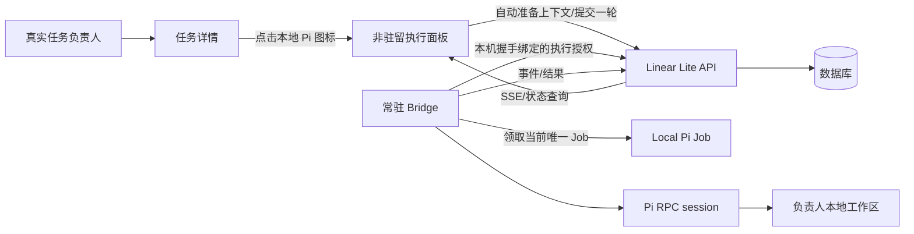
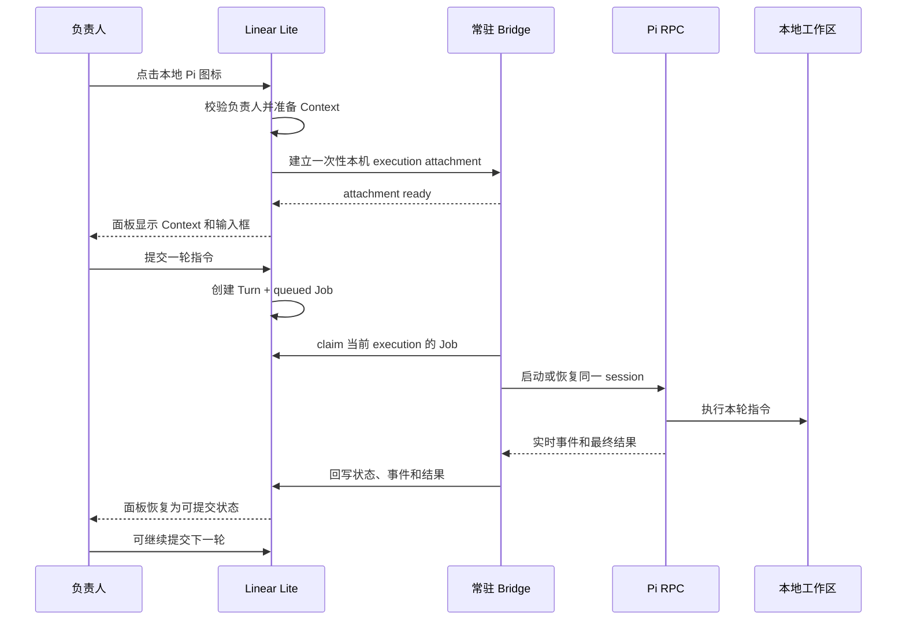

# Linear Lite × 本地 Pi 执行方案

## 1. 方案结论

采用“真实任务负责人 + 本地 Pi 图标入口 + 非驻留执行面板 + 单任务单轮执行 + 常驻 Bridge”的架构。

任务负责人始终是 Linear Lite 中的真实用户。Pi 不是用户、不是负责人，也不出现在负责人选择器、项目成员或评论 mention 中。

负责人通过任务详情中的本地 Pi 图标打开执行面板。执行面板不常驻、不改变任务详情布局；打开后自动准备当前任务上下文。面板底部始终保留输入框，负责人可以在上下文准备完成后提交一轮指令。

同一任务同一时间只允许一个本地 Pi Job。执行中不创建排队项、不接受下一轮提交；负责人只能终止当前 Job。当前 Job 结束后，输入框重新允许提交下一轮，后续轮次复用同一个执行上下文和 Pi session。

系统取消 Agent Token、Bridge Credential 及所有用户可见的凭证配置。Bridge 通过本机浏览器触发的一次性内存握手获得当前执行授权，不落盘、不出现在任务页面、不需要用户复制粘贴。

## 2. 领域边界

```text
Task Assignee       任务业务负责人，必须是真实用户
Local Pi Execution  负责人对当前任务发起的一组本地执行
Execution Context   连续多轮执行共享的上下文身份
Turn                负责人提交的一轮指令
Job                 一轮 Turn 对应的持久化执行单元
Bridge              用户电脑上的常驻本地进程
Pi                  Bridge 启动的本地执行进程
```

固定关系：

```text
tasks.assignee_id
  -> 真实用户
  -> 负责人点击本地 Pi 图标
  -> Execution Context
  -> 单个 queued Job
  -> Bridge
  -> 本地 Pi session
```

禁止关系：

```text
tasks.assignee_id -> Pi
任务创建/指派 -> 自动执行
普通评论/@Pi -> 执行
Bridge 扫描全部任务 -> 自动领取
任务页面展示或复制凭证
同一任务并行或排队多个 Job
```

## 3. 端到端架构



Linear Lite 负责任务权限、Execution Context、Turn、Job 和状态；Bridge 负责本地工作区、Pi 进程、心跳、事件和结果回写；浏览器只负责发起执行、补充输入和展示状态。

## 4. 用户交互

### 4.1 任务详情默认状态

- 任务详情页不显示本地 Pi 执行面板。
- 只有当前任务负责人看到本地 Pi 图标；非负责人看不到入口。
- 图标使用 tooltip 和 `aria-label`，不使用“交给本地 Pi”文字按钮。
- 任务属性侧栏、正文宽度和页面滚动行为不因本地 Pi 功能改变。
- 项目设置页、负责人选择器和评论编辑器不出现 Pi 配置入口。

### 4.2 打开执行面板

负责人点击本地 Pi 图标后：

1. 打开非驻留执行面板，面板覆盖在任务详情右侧，不挤压正文、不改变父布局宽度；
2. 浏览器向服务端请求或恢复当前任务的 Execution Context；
3. 若没有上下文，服务端创建一个 `waiting_input` Context；
4. 面板展示上下文摘要、当前状态和底部输入框；
5. 准备过程不创建 Job、不启动 Pi、不改变任务负责人、不改变任务业务状态。

“准备上下文”不是页面上的可见按钮，而是打开执行面板后的内部动作。准备中的状态通过面板状态文本展示。

### 4.3 底部输入框

输入框固定在执行面板底部，面板打开期间始终存在：

- 上下文准备中：输入框可编辑，发送按钮等待上下文就绪；
- 等待输入：输入框和发送按钮可用；
- 执行中：输入框仍可编辑，但发送按钮不可用，不产生排队；
- 执行完成或失败：输入框重新可提交下一轮；
- 当前任务终止：输入框回到等待输入状态，可重新提交。

负责人提交一轮输入后，服务端只创建一个 Job。执行中提交的内容不进入队列，前端不保存排队列表。

### 4.4 当前执行终止

执行中的面板只提供“终止当前执行”操作：

- 终止当前 Bridge Job；
- 停止当前 Pi 进程；
- 将 Job 标记为 `canceled`；
- 将 Execution Context 恢复为 `waiting_input`；
- 不创建取消队列、不影响任务负责人、不删除历史 Turn。

## 5. 状态模型

### 5.1 Execution Context

```text
absent -> preparing -> waiting_input -> running -> waiting_input
                                      \-> canceled -> waiting_input
                                      \-> completed
```

规则：

- 一个任务在同一负责人下最多一个 active Execution Context；
- 重复打开面板返回同一个 Context；
- `preparing` 和 `waiting_input` 没有 Job；
- `running` 同时只能有一个 Job；
- 终止当前 Job 后 Context 回到 `waiting_input`；
- 任务终态或负责人变更时 Context 进入 `canceled`，旧负责人不能继续操作。

### 5.2 Job

```text
none -> queued -> leased -> running -> succeeded
                              |       \-> failed
                              \-> canceled
```

规则：

- 只有负责人提交有效输入才创建 Job；
- 一个 Execution Context 不允许同时存在多个 `queued/leased/running` Job；
- Bridge 只领取当前用户通过当前执行面板创建的 Job；
- `succeeded`、`failed`、`canceled` 都是当前轮终态；
- 下一轮只能在当前 Job 终态后创建。

## 6. 数据模型

### 6.1 任务负责人

继续使用 `tasks.assignee_id`，但只允许真实用户：

```text
tasks.assignee_id -> users.id(principal_type=human)
```

任务创建、任务指派和普通评论不会写入 Execution Context 或 Job。

### 6.2 Execution Context

```text
local_pi_executions
  id
  execution_id
  task_id
  task_key
  project_id
  owner_user_id
  workspace_key
  session_id
  status             preparing | waiting_input | running | completed | canceled
  created_at
  updated_at
  completed_at
```

### 6.3 Turn

```text
local_pi_turns
  id
  execution_id
  owner_user_id
  prompt
  sequence_no
  created_at
```

### 6.4 Job

```text
local_pi_jobs
  id
  turn_id
  execution_id
  task_id
  task_key
  owner_user_id
  status             queued | leased | running | succeeded | failed | canceled
  attempt_count
  lease_until
  next_run_at
  error_message
  created_at
  started_at
  finished_at
```

### 6.5 Bridge 会话握手

不建立 Agent Token、Bridge Credential 或可复制凭证表。

本机握手只建立短时内存绑定：

```text
browser JWT
  -> 服务端创建一次性 execution attachment
  -> localhost Bridge attach
  -> Bridge 内存保存 owner_user_id + execution_id
  -> 执行结束或超时后释放
```

绑定不写入 Bridge 配置文件，不出现在日志、URL、页面文本或任务评论中。Bridge 只能通过已绑定的 `execution_id` 访问当前 Job。

## 7. API 设计

### 7.1 人类用户 API

```text
POST /api/tasks/{taskKey}/local-pi/prepare
GET  /api/tasks/{taskKey}/local-pi/status
POST /api/tasks/{taskKey}/local-pi/turns
POST /api/tasks/{taskKey}/local-pi/cancel
```

所有接口使用当前登录用户 JWT，服务端从会话取得用户 ID，不接受客户端传入负责人 ID。

`prepare`：

- 仅任务负责人可调用；
- 创建或恢复 active Execution Context；
- 不创建 Turn、不创建 Job、不启动 Pi；
- 返回 Context 状态和最近一轮结果。

`turns` 请求：

```json
{
  "executionId": "execution-opaque-id",
  "prompt": "请检查当前实现并完成本轮修改"
}
```

服务端校验任务负责人、Context 归属、Context 状态和输入内容。若当前已有 `queued/leased/running` Job，直接返回冲突，不创建队列项。

`cancel` 只终止当前 active Job，取消 `queued/leased/running` 状态，Context 回到 `waiting_input`，不删除历史 Turn。

### 7.2 Bridge API

Bridge API 不接受 Agent Token 或 Bridge Credential。请求必须来自当前 execution attachment，并且 attachment 只绑定一个负责人和一个 Execution Context：

```text
POST /api/bridge/executions/attach
POST /api/bridge/jobs/claim
POST /api/bridge/jobs/{jobId}/heartbeat
POST /api/bridge/jobs/{jobId}/events
GET  /api/bridge/jobs/{jobId}/status
POST /api/bridge/jobs/{jobId}/succeeded
POST /api/bridge/jobs/{jobId}/failed
POST /api/bridge/executions/{executionId}/detach
```

`claim` 必须同时满足：

```text
attachment.execution_id = job.execution_id
job.status = queued 或已过期 leased
execution.status = waiting_input
tasks.assignee_id = attachment.owner_user_id
任务未进入终态
```

Bridge 不扫描任务列表、不接收任意任务 ID、不接收任意工作区路径。

## 8. Bridge 与 Pi 运行链路



## 9. 常驻与恢复

Bridge 继续作为当前 macOS 用户的 `launchd LaunchAgent` 常驻：

```text
launchd
  -> Bridge
      -> localhost 控制服务
      -> 当前 execution attachment
      -> 当前唯一 Job 轮询
      -> Pi RPC 子进程
```

运行规则：

- `KeepAlive=true`、`ThrottleInterval=10`；
- Bridge 只轮询当前 attachment 对应的 Job；
- 网络中断时保留当前 Pi session 和 Job 租约；
- 网络恢复后继续心跳、事件和结果回写；
- Bridge 重启后由打开的执行面板重新 attach；
- 浏览器关闭或 attachment 过期时，Bridge 停止当前 Pi 进程并释放本地绑定；
- 任务被重新指派时，旧 Context 和 Job 失效，旧 Bridge 的回写被拒绝；
- Bridge 不提供公网入站端口。

## 10. 前端改造

### 10.1 入口

- 在任务详情头部操作区增加本地 Pi 图标；
- 只对当前任务负责人显示；
- 提供 tooltip、`aria-label` 和执行中状态标识；
- 删除“交给本地 Pi”“准备上下文”“生成凭证”等文字按钮；
- 删除项目设置中的 Pi Agent 配置入口。

### 10.2 执行面板

- 使用非驻留右侧 drawer 或浮层，不参与 `editor-panel` 的宽度计算；
- 打开后自动准备上下文，不展示准备按钮；
- 顶部显示任务标识、执行状态和关闭按钮；
- 中部显示上下文摘要、当前轮实时事件和最近结果；
- 底部使用 sticky composer，输入框始终在位；
- 执行中只显示“终止当前执行”，不显示排队列表；
- 面板关闭后保留服务端 Context，重新打开恢复状态。

### 10.3 负责人选择器与评论

- 负责人选择器只展示真实用户；
- 删除 Pi Agent 健康检查过滤和 Pi 选项；
- 评论编辑器删除 `@Pi` 触发语义；
- 普通评论永远不创建本地 Pi Job。

## 11. 删除范围

本次重构不保留兼容层：

1. 删除 Pi 用户、Pi 负责人和 `principal_type=agent` 的业务入口；
2. 删除项目 Pi Agent 配置接口和项目 Pi 绑定；
3. 删除任务创建、负责人变更和普通评论创建 Job 的逻辑；
4. 删除 Agent Token、Bridge Credential、凭证生成、凭证展示和凭证配置字段；
5. 删除旧 Agent API 和旧 `/agent-*` 任务接口；
6. 删除前端排队状态、排队列表和排队取消操作；
7. 删除旧 Agent session/job 语义，收敛为 Local Pi Execution/Job；
8. 不新增双读、双写、字段回退或旧配置 fallback。

## 12. 实施顺序

1. 收敛领域词汇和数据库模型，确保任务负责人始终是真实用户；
2. 删除 Pi 用户、Pi Agent 项目配置和自动创建 Job 路径；
3. 增加 prepare、status、turn、cancel 的负责人 API；
4. 增加 execution attachment，移除所有持久化凭证和配置页面；
5. 将 Job 创建点收敛到负责人提交 Turn 的事务；
6. 将 Bridge claim 限制为当前 attachment 的唯一 execution；
7. 重做任务详情入口和非驻留执行面板；
8. 将底部输入框固定为面板常驻 composer，执行中只允许终止；
9. 保留 launchd 常驻、网络重连、租约、心跳和 Pi session 恢复；
10. 删除旧文件、旧接口、旧字段和旧配置路径，形成单一路径。

## 13. 完成标准

- 任务详情默认不显示本地 Pi 面板；
- 只有负责人看到本地 Pi 图标；
- 点击图标后自动准备上下文，不显示准备按钮；
- 执行面板底部输入框始终在位；
- 同一任务同一时间最多一个 Job；
- 执行中不产生排队项，只能终止当前 Job；
- 当前 Job 结束后可以提交下一轮；
- 多轮执行复用同一个 Execution Context 和 Pi session；
- 普通评论、任务创建和负责人变更不会启动 Pi；
- 系统不创建、不展示、不要求用户复制任何凭证；
- Bridge 只能领取当前 execution attachment 对应的显式 Job；
- Bridge 重启或网络恢复后可以恢复当前执行；
- 任务重新指派后旧负责人和旧 Bridge 不能继续回写。
