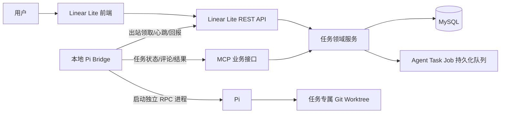
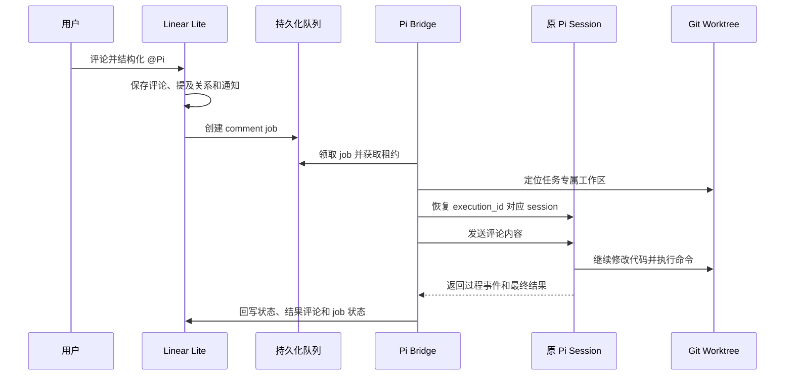

# Linear Lite × 本地 Pi 联动技术方案

## 1. 方案结论

采用“Linear Lite 后端编排 + 本地 Pi Bridge + Pi RPC 独立会话 + MCP 业务回写”的单一架构。

Linear Lite 负责任务指派、执行记录、可靠投递、权限和状态；Pi Bridge 负责领取任务、启动和恢复 Pi 进程；Pi 负责在指定工作区内处理代码；所有任务状态、评论和执行结果仍通过 Linear Lite 既有任务服务写回。

本方案支持：

- 创建任务时直接指派 Pi 并自动执行；
- 每个任务拥有独立的 Pi 会话和独立工作区；
- 任务未完成时通过评论 `@Pi` 恢复原会话继续处理；
- Pi、Bridge 或网络中断后的会话恢复；
- 任务重新指派后的旧会话终止；
- 多个任务并行执行且互不共享上下文和文件。

## 2. 总体架构



Linear Lite 不直接创建或管理 Pi 子进程，也不通过浏览器或内存态 SSE 触发执行。Bridge 主动向后端领取任务，因此后端无需访问本地端口，Pi 位于远程机器时仍可工作。

## 3. 身份与数据模型

### 3.1 Pi Agent 身份

沿用现有 `tasks.assignee_id` 作为唯一负责人字段，在 `users` 中增加主体类型：

```text
users.principal_type = human | agent
users.agent_key      = pi
```

Pi 使用专用 Agent 主体，不使用 `assignee_display_name`。Agent 主体不能通过普通登录入口登录，只能通过专用 Agent Credential 访问受保护接口。

任务负责人数据链路固定为：

```text
tasks.assignee_id
  -> users.id(principal_type=agent, agent_key=pi)
  -> project_members
  -> Pi Agent
  -> Pi Bridge
```

任务指派时必须校验：

1. 目标主体存在且已启用；
2. 目标主体是当前项目成员；
3. 当前项目已绑定 Pi 工作区。

不满足条件时拒绝指派，不自动切换到其他负责人或其他目录。

### 3.2 Agent Credential

新增 Agent Credential，服务端只保存哈希：

```text
agent_credentials
  id
  agent_user_id
  token_hash
  enabled
  expires_at
  last_seen_at
  created_at
```

Bridge 使用专用 Token 访问 Agent API 和 MCP。不得复用用户 JWT，不得把 Token 放入任务标题、描述、评论或 Pi prompt。

### 3.3 项目工作区绑定

新增项目与 Agent 工作区绑定：

```text
project_agent_bindings
  project_id
  agent_user_id
  workspace_key
  enabled
  created_at
  updated_at
```

`workspace_key` 是项目级稳定标识。Bridge 在本地配置中将它映射到实际 Git 仓库路径；Linear Lite 不接受任务提交的任意路径。

### 3.4 Agent 会话

一个任务的一次执行建立一个逻辑会话：

```text
agent_task_sessions
  id
  execution_id
  task_id
  task_key
  project_id
  agent_user_id
  session_id
  workspace_key
  status              active | completed | canceled
  created_at
  updated_at
  completed_at
```

`execution_id` 是 Linear Lite 的执行身份，`session_id` 是 Pi 的会话身份。二者都必须持久化，Bridge 重启后按原值恢复。

### 3.5 Agent 执行队列

```text
agent_task_jobs
  id
  session_id
  execution_id
  task_id
  task_key
  source_type          assignment | comment | retry
  source_comment_id
  status               queued | leased | running | succeeded | failed | canceled
  attempt_count
  lease_until
  next_run_at
  error_message
  created_at
  started_at
  finished_at
```

约束：

- 初次指派 Pi 创建 `assignment` job 和新的 session；
- `@Pi` 评论创建 `comment` job，但继续使用当前 session；
- 用户显式点击“重新开始”才创建 `retry` job 和新的 session；
- 同一评论只能产生一条 continuation job；
- 任务重新指派时，旧 session 及其未执行 job 全部取消。

## 4. 任务触发链路

### 4.1 创建或指派 Pi

任务创建和更新仍从现有 REST API 或 MCP 进入 `TaskCommandService`。在同一数据库事务中：

1. 写入任务负责人；
2. 记录任务活动；
3. 判断负责人是否发生到 Pi 的边沿变化；
4. 创建 `agent_task_sessions`；
5. 创建 `assignment` job。

只有以下负责人变化触发首次执行：

```text
未分配 -> Pi
其他负责人 -> Pi
```

Pi 已经是负责人时，修改标题、描述、标签或日期不自动重复执行。

### 4.2 评论 `@Pi` 继续原会话

当前评论 API 已经接收结构化 `mentionedUserIds`，因此触发逻辑只读取被提及的 Agent ID，不解析评论正文中的字符串 `@Pi`。

评论事务中执行：

1. 写入评论；
2. 写入评论提及关系；
3. 写入普通站内通知；
4. 若被提及主体是 Pi、任务当前负责人是 Pi、任务不是终态且存在 active session，则写入 `comment` job。

评论正文作为该 job 的唯一新增 prompt 内容。Bridge 按 `created_at + id` 顺序向同一个 Pi session 投递，保证用户反馈不会乱序。

触发规则固定如下：

| 条件 | 行为 |
|---|---|
| 当前负责人是 Pi，任务未完成，评论 @Pi | 恢复当前 session |
| Pi 当前仍在处理 | 通过 RPC `follow_up` 排队 |
| Pi 进程已退出但 session 存在 | 重新启动 Pi 并加载原 session |
| 任务已完成或已取消 | 只保存评论，不触发执行 |
| Pi 不是当前负责人 | 只保存普通提及通知 |
| session 文件不存在 | 标记 job 失败并明确提示会话不可恢复 |

不会因为 session 丢失而静默创建新会话。

### 4.3 运行时序



## 5. Pi Bridge 设计

### 5.1 进程模型

每个 active session 使用一个 Pi RPC 子进程：

```text
一个 agent_task_session
  -> 一个 Pi 进程
  -> 一个 session_id
  -> 一个 session 文件目录
  -> 一个 Git worktree
```

Pi 通过 `--mode rpc` 启动。Bridge 以任务工作区作为子进程 `cwd`，使用固定的 `session_id` 和 `session_dir` 恢复会话。

Bridge 不共享多个任务的 stdin/stdout，不复用一个全局 Pi 会话。

### 5.2 会话恢复

- Bridge 进程重启：按 `session_id` 恢复原会话；
- Pi 子进程异常退出：保留 job，等待租约超时后重新领取；
- RPC 正在执行时收到评论：使用 `follow_up` 排队；
- Pi 空闲时收到评论：恢复 session 后使用 `prompt`；
- 任务被重新指派：向旧 Pi 发送终止信号，取消旧 session 的未执行 job。

### 5.3 Pi 任务工具

Bridge 加载一个受控的 Linear Lite Pi Extension，为 Pi 提供以下任务级工具：

```text
linear_task_get
linear_task_comment
linear_task_update
linear_task_complete
linear_task_fail
```

这些工具只能操作当前 `execution_id` 对应的任务，不能由模型指定其他任务 Key。Bridge 负责校验任务范围，再通过 MCP 或任务 API 调用现有领域服务。

Pi 不直接访问 MySQL，也不直接调用任意 Linear Lite 任务接口。

## 6. 状态规则

### 6.1 Linear Lite 任务状态

继续沿用现有任务状态：

```text
backlog / todo -> in_progress -> done
```

- Pi 开始首次处理时更新为 `in_progress`；
- Pi 只有在显式调用 `linear_task_complete` 后才能更新为 `done`；
- 执行失败时任务保留 `in_progress`，并写入失败评论；
- 用户通过 `@Pi` 继续处理，不改变负责人和 execution_id。

### 6.2 Agent 状态

任务状态表示业务进度，Agent session/job 状态表示自动化执行进度，二者不混用：

```text
Session: active -> completed | canceled
Job: queued -> leased -> running -> succeeded | failed | canceled
```

一个 session 可以包含多个成功的 job：首次指派是一个 job，每次 `@Pi` 是一个 continuation job。

## 7. Agent API

新增受 Agent Credential 保护的接口：

```text
POST /api/agent/jobs/claim
POST /api/agent/jobs/{jobId}/heartbeat
POST /api/agent/jobs/{jobId}/succeeded
POST /api/agent/jobs/{jobId}/failed
POST /api/agent/sessions/{executionId}/cancel
GET  /api/agent/sessions/{executionId}
```

接口约束：

- 领取使用数据库租约，避免多个 Bridge 重复执行；
- 心跳超时后 job 可重新领取；
- 上报结果必须携带 `execution_id` 和 job 版本；
- 任务负责人、项目绑定或 session 已变化时拒绝旧 job 回写；
- Bridge 不提供公网入站监听。

现有 `/mcp` 继续作为业务操作入口，增加 Agent Credential 认证后复用既有项目成员、任务权限和评论服务。[McpController.java](/Users/huangzhiwen/Documents/work/02code/product/linear-lite-1/linear-lite-server/src/main/java/com/linearlite/server/controller/McpController.java:19)

## 8. 前端调整

### 8.1 负责人选择

- 负责人下拉框显示 Pi Agent；
- Agent 使用独立图标和类型标识；
- 只有项目已配置工作区时允许指派 Pi；
- 指派失败直接展示后端错误，不静默降级为普通负责人。

### 8.2 任务详情

增加 Pi 执行面板：

```text
当前会话：执行中 / 等待反馈 / 已完成 / 已失败 / 已取消
最近一次执行：开始时间、结束时间、错误信息
操作：继续处理、重新开始、取消执行
```

用户正常在评论编辑器中选择 Pi 进行结构化提及，即可触发原会话继续处理。

## 9. 安全与并发

- Agent Token 只保存哈希并支持撤销和轮换；
- Agent 只能访问已绑定项目；
- 每个 Bridge job 绑定唯一 `execution_id`；
- 同一 session 串行处理，不允许并行 prompt；
- 同一任务的旧 session 不能写回新负责人执行；
- Pi 工作区使用任务专属 Git worktree，文件系统不共享；
- 评论正文、任务描述和命令输出都视为不可信输入，不记录 Agent Token；
- 任务状态、评论和活动均复用现有领域服务，不新增绕过权限的数据库写入路径。

## 10. 实施顺序

1. 在 `schema.sql` 中落地 Agent 主体、Credential、项目工作区绑定、session 和 job 表。
2. 增加 Agent 认证、项目绑定和 Agent API。
3. 在任务创建/更新事务中增加 Pi 指派边沿检测和 assignment job 创建。
4. 在评论事务中增加结构化 `@Pi` 识别和 continuation job 创建。
5. 实现 Bridge 的领取、租约、心跳、Pi RPC 启停和 session 恢复。
6. 实现任务专属 Git worktree 和 Pi Extension。
7. 接入任务状态、评论、完成和失败回写。
8. 增加前端 Pi 负责人、执行状态和评论续接界面。

## 11. 完成标准

- 创建任务并指派 Pi 后，后端事务内产生可追踪的 assignment job。
- Bridge 可领取任务并为任务创建独立 Pi session 和 Git worktree。
- 每个任务的 Pi 上下文、stdin/stdout 和文件目录相互隔离。
- 任务未完成时，评论结构化 @Pi 能恢复原 execution_id 对应的 session。
- Pi 进程或 Bridge 重启后可以恢复原 session，不重复创建执行记录。
- 任务重新指派后，旧 session 不能继续修改任务。
- Pi 完成、失败、取消和继续处理均能在任务详情和评论中追踪。
- 所有任务变更经过既有权限、活动记录和任务领域服务。
