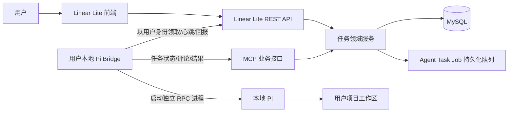
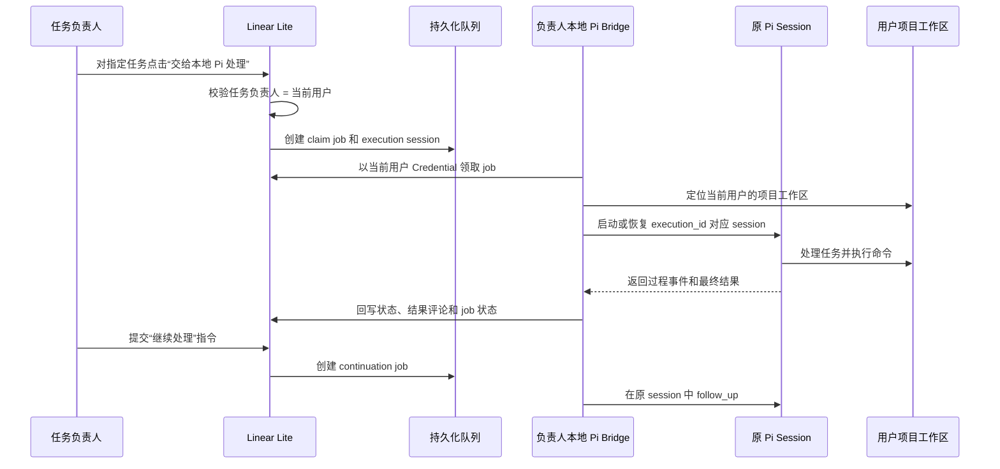

# Linear Lite × 本地 Pi 联动技术方案

## 1. 方案结论

采用“Linear Lite 后端编排 + 每位用户一个本地 Pi Bridge + Pi RPC 独立会话 + MCP 业务回写”的单一架构。

任务负责人始终是 Linear Lite 中的真实用户，Pi 不是用户、不是独立负责人，也不出现在负责人选择器中。每位用户在自己的电脑上运行一个本地 Pi Bridge，Bridge 以该用户的 Agent Credential 访问 Linear Lite，只能认领当前用户负责且被允许交给 Pi 处理的任务。Pi 负责在该用户配置的项目工作区内执行任务，所有任务状态、评论和执行结果仍通过 Linear Lite 既有任务服务写回。

本方案支持：

- 任务继续指派给真实用户，负责人语义不因 Pi 执行而改变；
- 用户将自己负责的指定任务交给本地 Pi 认领和处理；
- 每个任务拥有独立的 Pi 会话和独立工作区；
- 任务未完成时，用户可要求本地 Pi 在原会话中继续处理；
- Pi、Bridge 或网络中断后的会话恢复；
- 任务重新指派后的旧会话终止；
- 多个任务并行执行且互不共享上下文和文件。

## 2. 总体架构



Linear Lite 不直接创建或管理 Pi 子进程，也不通过浏览器或内存态 SSE 触发执行。Bridge 主动向后端领取任务，因此后端无需访问用户本地端口。

身份边界固定为：

```text
Linear Lite 用户账号
  -> 用户自己的 Agent Credential
  -> 用户自己的 Pi Bridge
  -> 用户自己的 Pi 进程
```

## 3. 身份与数据模型

### 3.1 任务负责人和本地 Pi 的关系

沿用现有 `tasks.assignee_id` 作为唯一负责人字段，但该字段只允许指向真实用户：

```text
tasks.assignee_id
  -> users.id(principal_type=human)
  -> 该用户本地 Pi Bridge
  -> Pi
```

系统不新增 Pi 用户，不在 `users` 中创建 `principal_type=agent` 或 `agent_key=pi` 的主体，也不把 Pi 写入 `tasks.assignee_id`。`assignee_display_name` 不能作为 Pi 执行身份或任务负责人来源。

本地 Pi 的执行权限由 Bridge 所属用户决定：

1. Bridge 必须使用当前用户自己的 Agent Credential；
2. Bridge 只能认领 `tasks.assignee_id = credential.owner_user_id` 的任务；
3. 任务必须属于该用户有权限访问的项目；
4. 项目必须配置该用户本地 Pi 使用的工作区；
5. 任何条件不满足时拒绝认领，不切换到其他用户、其他任务或其他目录。

### 3.2 Agent Credential

每位用户配置自己的本地 Pi 时创建一条 Credential，服务端只保存哈希：

```text
agent_credentials
  id
  owner_user_id       -- users.id，真实用户
  token_hash
  enabled
  expires_at
  last_seen_at
  created_at
```

Bridge 使用专用 Token 访问 Agent API 和 MCP。不得复用用户 JWT，不得把 Token 放入任务标题、描述、评论或 Pi prompt。Credential 的权限范围固定为 `owner_user_id` 对应用户可操作的数据。

### 3.3 用户项目工作区绑定

工作区绑定描述“哪个用户的本地 Pi 在哪个项目使用什么工作区”，不描述一个独立 Pi Agent：

```text
user_project_workspaces
  project_id
  owner_user_id       -- users.id，Bridge 所属用户
  workspace_key
  enabled
  created_at
  updated_at
```

`workspace_key` 是项目级稳定标识。用户本地 Bridge 将它映射到实际 Git 仓库路径；Linear Lite 不接受任务提交的任意路径。只有 `owner_user_id` 与任务负责人一致时，Bridge 才能使用该绑定执行任务。

### 3.4 Pi 执行会话

一个任务的一次 Pi 执行建立一个逻辑会话。会话记录执行时的真实负责人和 Bridge 所属用户，二者必须相同：

```text
agent_task_sessions
  id
  execution_id
  task_id
  task_key
  project_id
  assignee_user_id    -- tasks.assignee_id 的快照
  owner_user_id       -- Credential 所属用户，必须等于 assignee_user_id
  session_id
  workspace_key
  status              active | completed | canceled
  created_at
  updated_at
  completed_at
```

`execution_id` 是 Linear Lite 的执行身份，`session_id` 是 Pi 的会话身份。二者都必须持久化，Bridge 重启后按原值恢复。任务负责人变更后，旧会话不能继续写回。

### 3.5 Pi 执行队列

```text
agent_task_jobs
  id
  session_id
  execution_id
  task_id
  task_key
  owner_user_id
  source_type          claim | continuation | retry
  source_comment_id
  status               queued | leased | running | succeeded | failed | canceled
  attempt_count
  lease_until
  next_run_at
  error_message
  created_at
  started_at
  finished_at
```

约束：

- 本地 Pi 原子认领任务时创建 `claim` job 和新的 session；
- 用户要求本地 Pi 继续处理时创建 `continuation` job，并继续使用当前 session；
- 用户显式点击“重新开始”才创建 `retry` job 和新的 session；
- 同一任务、同一评论只能产生一条 continuation job；
- 任务重新指派时，旧 session 及其未执行 job 全部取消；
- job 的 `owner_user_id` 必须等于 session 的 `owner_user_id`，且等于任务当前 `assignee_id`。

## 4. 任务触发和认领链路

### 4.1 负责人指派

任务创建和更新仍从现有 REST API 或 MCP 进入 `TaskCommandService`。任务负责人只从真实项目成员中选择，指派流程只负责写入负责人和活动记录，不因为负责人是某个 Agent 而创建执行任务。

负责人变化时：

1. 写入新的 `tasks.assignee_id`；
2. 记录任务活动；
3. 取消旧负责人对应的 active session 和未执行 job；
4. 不自动将任务负责人改为 Pi，也不自动替换为其他负责人。

任务是否交给 Pi 处理，由负责人自己的本地 Pi Bridge 通过认领接口决定。

### 4.2 本地 Pi 认领指定责任人的任务

Bridge 使用 Credential 访问“可认领任务”接口。服务端从 Credential 得到唯一的 `owner_user_id`，只返回满足以下条件的任务：

```text
tasks.assignee_id = owner_user_id
任务属于 owner_user_id 可访问的项目
项目存在 owner_user_id 的启用工作区绑定
任务不是终态
任务没有其他有效 session
```

用户在 Linear Lite 中对指定任务点击“交给本地 Pi 处理”，或在本地 Pi Bridge 中选择该任务后，Bridge 调用认领接口。认领必须在数据库事务中完成：

1. 校验任务当前负责人等于 Credential 所属用户；
2. 校验项目权限和用户工作区绑定；
3. 校验任务没有其他 active session；
4. 创建 `agent_task_sessions`；
5. 创建 `claim` job；
6. 返回 `execution_id`、`session_id` 和任务快照。

认领成功后，Pi Bridge 才启动本地 Pi 进程。认领失败直接返回明确错误，不降级为其他用户、不创建无负责人执行记录。

### 4.3 继续处理

本地 Pi 不是可被任务评论 `@` 的用户。用户在任务详情中点击“继续交给本地 Pi 处理”，或在当前 Pi 执行面板提交继续指令，系统创建 `continuation` job。继续指令的评论正文作为该 job 的唯一新增 prompt 内容。

创建 continuation job 时必须校验：

1. 当前操作用户是任务负责人；
2. 当前任务负责人仍等于 session 的 `owner_user_id`；
3. session 处于 `active`；
4. 任务不是终态。

Bridge 按 `created_at + id` 顺序向同一个 Pi session 投递，保证用户反馈不会乱序。任务负责人变更后，原负责人不能再为该任务创建 continuation job。

触发规则固定如下：

| 条件 | 行为 |
|---|---|
| 本地 Pi 认领当前用户负责的未完成任务 | 创建 claim job 和新 session |
| 当前 session 正在处理，用户提交继续指令 | 创建 continuation job，使用 RPC `follow_up` 排队 |
| Pi 进程已退出但 session 存在 | 重新启动 Pi 并加载原 session |
| 任务已完成或已取消 | 只保存操作记录，不触发执行 |
| Bridge 所属用户不是当前任务负责人 | 拒绝认领或继续处理 |
| session 文件不存在 | 标记 job 失败并明确提示会话不可恢复 |

不会因为 session 丢失而静默创建新会话。

### 4.4 运行时序



## 5. 本地 Pi Bridge 设计

### 5.1 进程模型

每个 active session 使用一个 Pi RPC 子进程：

```text
一个 agent_task_session
  -> 一个 Pi 进程
  -> 一个 session_id
  -> 一个 session 文件目录
  -> 一个 owner_user_id 的项目工作区
```

Pi 通过 `--mode rpc` 启动。Bridge 以用户项目工作区作为子进程 `cwd`，使用固定的 `session_id` 和 `session_dir` 恢复会话。

Bridge 不共享多个任务的 stdin/stdout，不复用一个全局 Pi 会话。

### 5.2 会话恢复

- Bridge 进程重启：按 `session_id` 恢复原会话；
- Pi 子进程异常退出：保留 job，等待租约超时后由同一用户的 Bridge 重新领取；
- RPC 正在执行时收到继续指令：使用 `follow_up` 排队；
- Pi 空闲时收到继续指令：恢复 session 后使用 `prompt`；
- 任务被重新指派：向旧 Pi 发送终止信号，取消旧 session 的未执行 job。

### 5.3 Pi 任务工具

Bridge 加载一个受控的 Linear Lite Pi Extension，为 Pi 提供以下任务级工具：

```text
linear_task_get
linear_task_comment
linear_task_update
linear_task_complete
linear_task_fail
```

这些工具只能操作当前 `execution_id` 对应的任务。Bridge 负责校验 `owner_user_id = tasks.assignee_id`，再通过 MCP 或任务 API 调用现有领域服务。Pi 不直接访问 MySQL，也不直接调用任意 Linear Lite 任务接口。

## 6. 状态规则

### 6.1 Linear Lite 任务状态

继续沿用现有任务状态：

```text
backlog / todo -> in_progress -> done
```

- 本地 Pi 开始首次处理时更新为 `in_progress`；
- Pi 只有在显式调用 `linear_task_complete` 后才能更新为 `done`；
- 执行失败时任务保留 `in_progress`，并写入失败评论；
- 用户继续处理时不改变负责人和 `execution_id`。

### 6.2 执行状态

任务状态表示业务进度，Pi session/job 状态表示自动化执行进度，二者不混用：

```text
Session: active -> completed | canceled
Job: queued -> leased -> running -> succeeded | failed | canceled
```

一个 session 可以包含多个成功的 job：首次认领是一个 job，每次继续处理是一个 continuation job。

## 7. Agent API

新增受 Agent Credential 保护的接口。所有接口从 Token 解析 `owner_user_id`，不接受客户端传入的 Agent 用户 ID：

```text
GET  /api/agent/tasks/available
POST /api/agent/tasks/{taskKey}/claim
POST /api/agent/jobs/{jobId}/heartbeat
POST /api/agent/jobs/{jobId}/succeeded
POST /api/agent/jobs/{jobId}/failed
GET  /api/agent/sessions/{executionId}
POST /api/agent/sessions/{executionId}/cancel
```

接口约束：

- 可认领任务查询只返回当前 Credential 所属用户负责的任务；
- 认领使用数据库事务和唯一有效 session 约束，避免多个本地 Bridge 重复执行；
- 心跳超时后 job 可由同一用户的 Bridge 重新领取；
- 上报结果必须携带 `execution_id` 和 job 版本；
- 任务负责人、用户工作区绑定或 session 已变化时拒绝旧 job 回写；
- Bridge 不提供公网入站监听。

现有 `/mcp` 继续作为业务操作入口，增加 Agent Credential 认证后复用既有项目成员、任务权限和评论服务。[McpController.java](/Users/huangzhiwen/Documents/work/02code/product/linear-lite-1/linear-lite-server/src/main/java/com/linearlite/server/controller/McpController.java:19)

## 8. 前端调整

### 8.1 负责人选择

- 负责人下拉框只显示真实项目成员，不显示 Pi；
- 任务负责人字段继续展示真实用户；
- 删除“将 Pi 指派为负责人”的交互和文案；
- 在任务详情增加“交给本地 Pi 处理”操作；
- 只有当前登录用户是任务负责人，且当前项目存在该用户的工作区绑定时，才允许发起认领；
- 认领失败直接展示后端错误，不静默切换负责人或工作区。

### 8.2 任务详情

增加本地 Pi 执行面板：

```text
负责人：真实用户
执行代理：负责人本地 Pi
当前会话：执行中 / 等待反馈 / 已完成 / 已失败 / 已取消
最近一次执行：开始时间、结束时间、错误信息
操作：交给本地 Pi 处理、继续处理、重新开始、取消执行
```

“执行代理”是执行来源展示，不是任务负责人字段。评论编辑器不提供 `@Pi` 提及选项；继续处理通过结构化操作创建 continuation job。

## 9. 安全与并发

- Agent Token 只保存哈希并支持撤销和轮换；
- Agent Credential 绑定真实用户，不能绑定不存在的 Pi 主体；
- Bridge 只能访问 Credential 所属用户负责且有权限访问的项目任务；
- 每个 Bridge job 绑定唯一 `owner_user_id` 和 `execution_id`；
- 同一 session 串行处理，不允许并行 prompt；
- 同一任务的旧 session 不能写回新负责人执行；
- Pi 工作区使用任务专属 Git worktree，文件系统不共享；
- 评论正文、任务描述和命令输出都视为不可信输入，不记录 Agent Token；
- 任务状态、评论和活动均复用现有领域服务，不新增绕过权限的数据库写入路径。

## 10. 实施顺序

1. 在 `schema.sql` 中将 Agent 身份改为用户 Credential，并落地用户项目工作区、session 和 job 表；
2. 删除 Pi 独立用户主体和“Pi 作为负责人”的数据路径；
3. 增加按 `owner_user_id` 限定范围的 Agent 认证、可认领任务查询和认领 API；
4. 实现认领事务、租约、心跳、Pi RPC 启停和 session 恢复；
5. 实现任务专属 Git worktree 和 Pi Extension；
6. 实现继续处理、任务状态、评论、完成和失败回写；
7. 增加前端“交给本地 Pi 处理”及执行状态界面，移除 Pi 负责人和 `@Pi` 交互。

## 11. 完成标准

- 所有任务的负责人始终是真实用户，系统不存在 Pi 作为任务负责人的数据路径；
- 本地 Pi Bridge 只能认领其 Credential 所属用户负责的指定任务；
- 认领后后端产生可追踪的 claim job 和 execution session；
- Bridge 可为任务创建独立 Pi session 和 Git worktree；
- 每个任务的 Pi 上下文、stdin/stdout 和文件目录相互隔离；
- 任务未完成时，负责人提交继续处理指令能恢复原 `execution_id` 对应的 session；
- Pi 进程或 Bridge 重启后可以恢复原 session，不重复创建执行记录；
- 任务重新指派后，旧负责人本地 Pi 不能继续修改任务；
- Pi 完成、失败、取消和继续处理均能在任务详情和评论中追踪；
- 所有任务变更经过既有权限、活动记录和任务领域服务。
