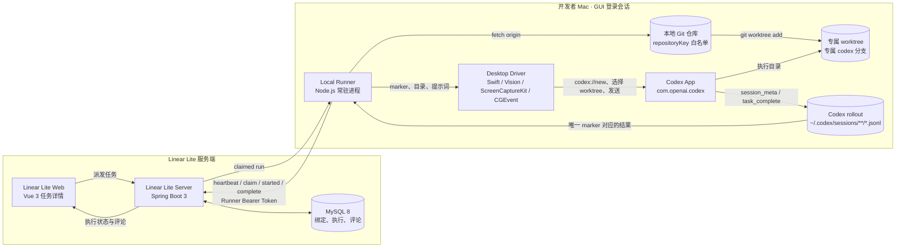
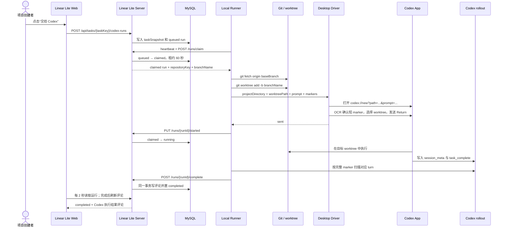
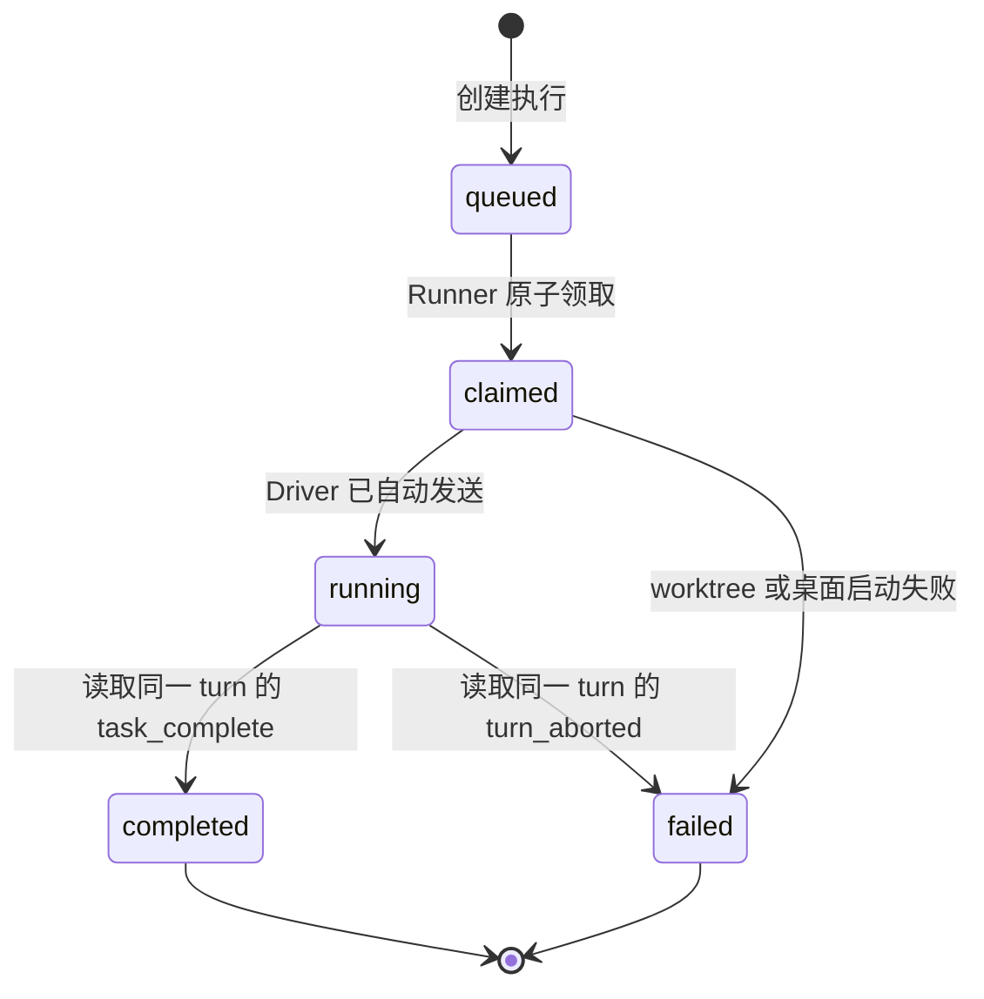

# Linear Lite 派发 Codex App 执行：实现与部署方案

- 更新日期：2026-07-23
- 状态：已实施并通过端到端测试
- 适用范围：Linear Lite 项目任务派发至开发者本机 Codex App，并将最终结果回写为任务评论

## 1. 交付结果

该实现形成一条固定链路：

1. 项目创建者在 Linear Lite 任务详情中点击“交给 Codex”；
2. Linear Lite Server 按任务的 `taskKey` 创建一次不可变执行快照；
3. 开发者 Mac 上的 Runner 领取执行，在绑定仓库中创建专属 Git 分支和 worktree；
4. macOS Desktop Driver 打开 Codex App 的新任务，选择本次 worktree 并自动发送；
5. Codex App 在本机执行任务，并把会话记录写入本机 rollout 文件；
6. Runner 通过本次执行的唯一 marker 找到对应 turn 和最终回答；
7. Linear Lite Server 在同一事务中把执行置为 `completed`，并新增一条“Codex 执行结果”任务评论；
8. 任务详情每 2 秒刷新活动执行；进入 `completed` 后立即刷新评论区。

一次成功完成的 Linear Lite 执行使用：

- 一个 `codex_runs.id`；
- 一个专属分支；
- 一个专属 Git worktree；
- 一个 Codex App 新任务；
- 一个由完整 activation marker 锁定的 Codex turn；
- 一条完成结果评论。

任务执行发生在开发者 Mac，不发生在 Linear Lite 服务器。实现不调用 Codex CLI，也不通过公共 Codex 会话领取任务。

## 2. 总体架构

可交互、可导出版本：[Linear Lite × Codex App 架构图](../diagrams/linear-lite-codex-architecture.html)



### 2.1 组件职责

| 组件 | 部署位置 | 固定职责 |
| --- | --- | --- |
| Linear Lite Web | Linear Lite 单 JAR 静态资源 | 创建连接码、保存项目绑定、派发任务、展示执行状态与结果评论 |
| Linear Lite Server | Linux 服务器 | 用户与 Runner 鉴权、任务快照、执行状态机、租约、幂等、结果评论事务 |
| MySQL | Linux 服务器 | 保存 Runner、仓库元数据、项目绑定、运行、事件、消息和任务评论 |
| Local Runner | 开发者 Mac | 心跳、领取、创建 worktree、启动 Driver、扫描 rollout、同步终态 |
| Desktop Driver | 开发者 Mac | 打开 Codex App、OCR 确认任务、选择 worktree、发送 Return |
| Codex App | 开发者 Mac | 在目标 worktree 中执行任务并产生本地会话记录 |
| Codex rollout | 开发者 Mac | 保存 `session_meta`、用户消息、`task_complete` 和 `turn_aborted` |

### 2.2 部署边界

- 服务端不保存本地仓库绝对路径、Git 凭据或 Codex 登录凭据。
- Runner 只向服务端发起请求；服务端不向开发者 Mac 建立入站连接。
- 本地仓库绝对路径与原始 Runner Token 只保存在 Mac 的 `runner.json`。
- Desktop Driver 的截图只进入本机 ScreenCaptureKit/Vision 处理流程，未写入文件，也未上传服务端。
- Codex 的会话与执行仍由 Codex App 管理，Linear Lite 只保存 thread ID、最终回答和结构化结果摘要。

## 3. 唯一数据路径与身份关联

### 3.1 任务路径

```text
taskKey
  → Task 数据库记录
  → 派发时 taskSnapshot
  → codex_runs.id
  → 分支 codex/<task-key-lower>-<run-id 前 8 位>
  → 本地 worktree <stateDirectory>/worktrees/<run-id>
```

`taskSnapshot` 在派发事务中生成，包含任务键、项目、标题、描述、状态、优先级、标签、日期和 `updatedAt`。Runner 始终执行该快照，不在执行阶段重新搜索任务。

### 3.2 仓库路径

```text
project_codex_bindings.repository_id
  → codex_repositories.repository_key
  → runner.json.repositories[repositoryKey]
  → 唯一本地仓库 path
```

服务端只下发 `repositoryId` 和由服务端补齐的 `repositoryKey`。Runner 只在本地仓库白名单中按该 key 解析路径，不接收服务端下发的任意文件系统路径。

### 3.3 会话与结果路径

完整 activation marker 固定为：

```text
linear-lite-run:<run-id>
```

用于桌面 OCR 的短 marker 固定为：

```text
LLRUN-<run-id 前 8 位大写>
```

完整结果关联只走以下路径：

```text
[linear-lite-run:<run-id>] 用户提示词前缀
  → response_item 中的 metadata.turn_id
  → 同一 turn_id 的 event_msg.task_complete
  → last_agent_message
  → result_summary
  → TaskComment
```

同一 rollout 中：

- `session_meta.payload.id` 写入 `codex_thread_id`；
- `response_item` 必须是用户消息，且文本必须以完整 marker 和换行开头；
- `task_complete.payload.turn_id` 必须等于该用户消息的 `turn_id`；
- `last_agent_message` 写入 `result_summary`；
- `duration_ms`、`threadId`、`turnId` 写入 `result_payload`；
- `turn_aborted` 映射为 `failed / CODEX_DESKTOP_TURN_ABORTED`。

会话标题、任务标题和自然语言相似度均不参与结果关联。

## 4. 项目绑定与 Runner 注册

### 4.1 注册流程

1. 项目创建者在项目设置的 Codex 区域创建 Runner 连接码；
2. 服务端保存连接码的 SHA-256 哈希，连接码有效期为 10 分钟且只能消费一次；
3. Mac 使用连接码调用注册接口；
4. 服务端创建 `active` Runner，保存 Runner Token 的 SHA-256 哈希，并只返回一次原始 Token；
5. 原始 Token 写入本机 `runner.json`；
6. Runner 每 5 秒循环时先发送 heartbeat，并上报本地仓库元数据；
7. 服务端以 `(runner_id, repository_key)` 更新仓库登记和 `last_seen_at`。

注册请求：

```http
POST /api/codex-runner/register
Content-Type: application/json

{
  "enrollmentCode": "<项目设置中生成的连接码>",
  "name": "<Runner 显示名称>"
}
```

### 4.2 项目绑定

项目创建者在项目设置中选择：

- 一个状态为 `active` 的 Runner；
- 该 Runner 上报的一个仓库；
- 一个存在于该仓库 `origin` 的基础分支。

服务端按 `project_id` 唯一保存：

```text
project_id + runner_id + repository_id + base_branch
```

派发前服务端检查：

- 操作者是项目创建者；
- 项目已经绑定 Runner、仓库和基础分支；
- Runner 状态为 `active`；
- Runner 最近 60 秒内有 heartbeat；
- 同一任务不存在 `queued`、`claimed`、`running` 或 `needs_input` 执行。

## 5. 执行时序

可交互、可导出版本：[Linear Lite × Codex App 执行时序图](../diagrams/linear-lite-codex-sequence.html)



### 5.1 派发

前端生成 `clientRequestId`，调用：

```http
POST /api/tasks/{taskKey}/codex-runs
```

服务端按 `(created_by, client_request_id)` 做幂等查询；重复请求返回已经存在的 run。新 run 的状态为 `queued`，分支名由服务端一次性生成。

### 5.2 领取与租约

Runner 每轮执行顺序固定为：

1. heartbeat；
2. 同步已经结束的 Codex App turn；
3. claim 一个 run；
4. 没有 run 时等待 5 秒进入下一轮。

服务端领取顺序固定为：

1. 当前 Runner 上租约已过期的 `claimed/running/needs_input` run，按创建时间最早领取；
2. 否则领取最早的 `queued` run；
3. 使用 `FOR UPDATE` 锁定记录；
4. `queued` 转为 `claimed`，并写入 60 秒租约。

### 5.3 隔离工作区

Runner 对 `claimed` run 执行：

```text
git -C <repository.path> remote get-url origin
git -C <repository.path> fetch origin <baseBranch>
git -C <repository.path> worktree add -b <branchName> <worktreePath> origin/<baseBranch>
```

工作区固定为：

```text
<stateDirectory>/worktrees/<run-id>
```

分支固定为：

```text
codex/<task-key-lowercase>-<run-id 前 8 位>
```

### 5.4 提示词

Runner 将 BlockNote 描述 JSON 转为纯文本，再构造唯一提示词：

```text
[linear-lite-run:<run-id>]
[LLRUN-<run-id 前 8 位大写>]
Linear Lite 任务 <taskKey>：<title>

任务目标：
<纯文本描述>

补充指令：<dispatchInstruction>

执行环境：独立 Git worktree 和分支 <branchName> 已准备完成，不需要重复核对。
执行规则：若任务只是查询或问答，直接回答，不检查仓库、Git 或执行环境，不扩大任务范围；仅当任务明确要求修改代码时，才检查工作区并完成必要的实现和验证。不要提交、推送或创建合并请求。
```

查询与问答不执行仓库检查；明确要求修改代码时才进入代码实现与验证流程。

### 5.5 Desktop Driver

Runner 根据 Swift 源码 SHA-256 判断 Driver 是否需要重新编译。Driver 安装到：

```text
<stateDirectory>/apps/LinearLiteCodexDesktopDriver.app
```

应用固定 bundle identifier：

```text
com.linearlite.codex-desktop-driver
```

Driver 使用固定 designated requirement 进行 ad-hoc codesign，保持 macOS TCC 授权身份稳定。启动流程固定为：

1. 检查辅助功能权限；
2. 打开 `codex://new?path=<projectDirectory>&prompt=<prompt>`；
3. 等待 `com.openai.codex` 运行并激活；
4. 通过 ScreenCaptureKit 截取 Codex 窗口；
5. 使用 Vision `.fast` OCR 查找短 marker；
6. 点击项目仓库选择器；
7. 按 `branchName` 或 worktree 目录名选择本次 worktree；
8. 再次确认短 marker；
9. 通过 CGEvent 发送 Return；
10. 返回 `sent`。

Driver 返回 `sent` 后，Runner 原子写入：

```text
<stateDirectory>/runs/<run-id>.json
```

文件包含 `runId`、`worktreePath`、`branchName`、完整 activation marker。随后 Runner 将服务端状态置为 `running`，并写入 `desktop_session_started` 事件。

### 5.6 结果同步

Runner 每轮领取前递归扫描：

```text
$CODEX_HOME/sessions/**/*.jsonl
```

当前部署的 `CODEX_HOME` 为：

```text
/Users/huangzhiwen/.codex
```

匹配成功后 Runner 上报：

```json
{
  "status": "completed",
  "codexThreadId": "<session_meta.payload.id>",
  "resultSummary": "<task_complete.last_agent_message>",
  "resultPayload": "{\"source\":\"codex_desktop_session\",\"threadId\":\"...\",\"turnId\":\"...\",\"durationMs\":12345}",
  "errorCode": null,
  "errorMessage": null
}
```

服务端对 run 使用 `FOR UPDATE`：

- 已经是终态时直接返回，不重复写评论；
- `completed` 必须同时提供 `codexThreadId`、`resultSummary` 和 `resultPayload`；
- 新增一级任务评论，作者为执行发起者，正文为 `**Codex 执行结果**` 加最终回答；
- 评论插入与 run 终态更新在同一事务中提交。

服务端成功后，Runner 在本地 run 状态文件中原子写入 `resultSyncedAt`，后续轮询不再上报该结果。

## 6. 执行状态机



| 状态 | 含义 | 写入者 |
| --- | --- | --- |
| `queued` | 执行快照和绑定已经固化，等待本机 Runner | Linear Lite Server |
| `claimed` | Runner 已领取，并持有 60 秒租约 | Linear Lite Server |
| `running` | Driver 已把任务发送到目标 Codex App worktree | Local Runner |
| `completed` | 对应 Codex turn 已产生最终回答，结果与评论已提交 | Local Runner + Linear Lite Server |
| `failed` | 本机准备、桌面启动或 Codex turn 失败 | Local Runner + Linear Lite Server |

## 7. 核心接口

### 7.1 用户接口（JWT）

| 方法 | 路径 | 用途 |
| --- | --- | --- |
| `POST` | `/api/codex-runners/enrollment-codes` | 创建 10 分钟一次性连接码 |
| `GET` | `/api/codex-runners` | 查询当前用户的 Runner |
| `GET` | `/api/codex-runners/{runnerId}/repositories` | 查询 Runner 上报的仓库 |
| `DELETE` | `/api/codex-runners/{runnerId}` | 撤销 Runner，并将其活动执行置为失败 |
| `GET` | `/api/projects/{projectId}/codex-binding` | 查询项目绑定 |
| `PUT` | `/api/projects/{projectId}/codex-binding` | 保存 Runner、仓库和基础分支 |
| `POST` | `/api/tasks/{taskKey}/codex-runs` | 派发任务 |
| `GET` | `/api/tasks/{taskKey}/codex-runs` | 查询任务执行列表 |
| `GET` | `/api/codex-runs/{runId}` | 查询单次执行 |
| `GET` | `/api/codex-runs/{runId}/events` | 查询执行事件 |

### 7.2 Runner 接口（Runner Bearer Token）

| 方法 | 路径 | 用途 |
| --- | --- | --- |
| `POST` | `/api/codex-runner/register` | 使用一次性连接码注册 Runner |
| `PUT` | `/api/codex-runner/heartbeat` | 更新在线时间与仓库登记 |
| `POST` | `/api/codex-runner/runs/claim` | 原子领取一个执行 |
| `PUT` | `/api/codex-runner/runs/{runId}/lease` | 续租活动执行 |
| `PUT` | `/api/codex-runner/runs/{runId}/started` | `claimed → running` |
| `POST` | `/api/codex-runner/runs/{runId}/events` | 写入幂等序号事件 |
| `POST` | `/api/codex-runner/runs/{runId}/complete` | 写入完成或失败终态 |

## 8. 数据模型

| 表 | 关键约束 | 用途 |
| --- | --- | --- |
| `codex_runner_enrollment_codes` | `code_hash` 唯一 | 一次性连接码、有效期和消费时间 |
| `codex_runners` | `token_hash` 唯一 | Runner 所有者、状态、心跳、撤销时间 |
| `codex_repositories` | `(runner_id, repository_key)` 唯一 | Runner 上报的非敏感仓库元数据 |
| `project_codex_bindings` | `project_id` 唯一 | 项目到 Runner、仓库、基础分支的唯一绑定 |
| `codex_runs` | `(created_by, client_request_id)` 唯一；`codex_thread_id` 唯一 | 不可变任务快照、分支、状态、租约、结果和错误 |
| `codex_run_events` | `(run_id, sequence_no)` 唯一 | 幂等执行事件 |
| `codex_run_messages` | `run_id + status + created_at` 索引 | 补充消息队列 |
| `task_comments` | 现有任务评论模型 | 保存 Codex 最终回答 |

## 9. 安全与一致性

### 9.1 鉴权

- Web 用户接口使用 Linear Lite JWT；
- Runner 注册只接受未消费且未过期的连接码；
- 其他 `/api/codex-runner/**` 接口只接受 Runner Bearer Token；
- 服务端只保存连接码和 Runner Token 的 SHA-256 哈希；
- 项目绑定和派发只允许项目创建者执行；
- Runner 只能访问 `runner_id` 与自身一致的 run。

### 9.2 本地边界

- Runner 配置只允许固定 `repositories` 白名单；
- heartbeat 的 `remoteIdentity` 拒绝包含 `@` 或 `://` 的值；
- Desktop Driver 只控制配置的 `com.openai.codex`；
- 缺少辅助功能或屏幕录制权限时，Driver 返回稳定错误码并停止；
- 事件负载超过 8192 字符，或包含 `Authorization`、`CODEX_API_KEY` 时，服务端拒绝写入。

### 9.3 幂等

- 前端派发：`created_by + client_request_id`；
- Runner 领取：数据库行锁 + 60 秒租约；
- 执行事件：`run_id + sequence_no`；
- 完成回写：run 行锁 + 终态直接返回；
- 本地结果同步：`resultSyncedAt`；
- thread 归属：`codex_thread_id` 唯一。

## 10. 可重复部署

### 10.1 环境要求

构建机：

- JDK 17；
- Maven；
- Node.js 22 与 npm。

Linux 运行服务器：

- JRE 17；
- MySQL 8；
- 可访问的 `SERVER_PORT`，当前为 `9080`。

开发者 Mac：

- macOS；
- Node.js 22；
- Git；
- Xcode Command Line Tools 提供的 `swiftc`；
- 已安装并登录的 Codex App；
- 对 Desktop Driver 授予“辅助功能”和“屏幕与系统音频录制”。

### 10.2 构建与部署 Linear Lite Server

数据库执行合并后的 schema：

```bash
mysql -h <mysql-host> -P 3306 -u <mysql-user> -p <mysql-database> \
  < linear-lite-server/src/main/resources/schema.sql
```

构建单 JAR：

```bash
cd linear-lite-server
mvn clean package
```

Maven 在 `generate-resources` 阶段自动执行项目根目录的 `npm ci` 和 `npm run build`，再把 `dist` 复制到 JAR 的静态资源目录。

部署文件：

```text
<deploy-directory>/linear-lite-server-0.1.0-SNAPSHOT.jar
<deploy-directory>/start-server.sh
<deploy-directory>/.env
```

`.env` 至少设置：

```text
MYSQL_HOST=<host>
MYSQL_PORT=3306
MYSQL_DATABASE=linear_lite
MYSQL_USERNAME=<user>
MYSQL_PASSWORD=<password>
JWT_SECRET=<production-secret>
SERVER_PORT=9080
```

启动：

```bash
cd <deploy-directory>
chmod +x start-server.sh
./start-server.sh restart
./start-server.sh status
```

当前服务器落地参数：

| 项目 | 当前值 |
| --- | --- |
| 服务地址 | `http://124.223.84.101:9080` |
| 部署目录 | `/home/deploy/linear-lite` |
| JAR | `/home/deploy/linear-lite/linear-lite-server-0.1.0-SNAPSHOT.jar` |
| 启动脚本 | `/home/deploy/linear-lite/start-server.sh` |

### 10.3 构建 Local Runner

```bash
cd linear-lite-codex-runner
npm ci
npm test
npm run build
```

创建本机配置目录：

```bash
mkdir -p ~/.config/linear-lite-codex-runner/logs
mkdir -p ~/.config/linear-lite-codex-runner/state
```

注册 Runner 后创建 `~/.config/linear-lite-codex-runner/runner.json`：

```json
{
  "serverUrl": "http://124.223.84.101:9080",
  "runnerToken": "<注册接口返回的 Runner Token>",
  "stateDirectory": "/Users/<user>/.config/linear-lite-codex-runner/state",
  "codexDesktopAppBundleIdentifier": "com.openai.codex",
  "codexDesktopLaunchTimeoutSeconds": 30,
  "repositories": {
    "linear-lite": {
      "path": "/absolute/path/to/linear-lite",
      "displayName": "Linear Lite",
      "remoteIdentity": "github.com/<owner>/<repository>.git",
      "defaultBranch": "main"
    }
  }
}
```

Runner 运行时只读取上述固定字段；本地仓库路径只按 `repositoryKey` 从 `repositories` 中解析。

### 10.4 授权 Desktop Driver

Codex App 保持打开，先触发辅助功能授权：

```bash
cd linear-lite-codex-runner
npm run start -- /absolute/path/to/runner.json request-desktop-access
```

再触发窗口识别，以完成屏幕录制授权：

```bash
npm run start -- /absolute/path/to/runner.json inspect-desktop
```

在“系统设置 → 隐私与安全性”确认：

- “辅助功能”中的 `LinearLiteCodexDesktopDriver` 已开启；
- “屏幕与系统音频录制”中的 `LinearLiteCodexDesktopDriver` 已开启。

授权后退出本次 Driver 进程，再由 LaunchAgent 启动 Runner。

### 10.5 以 LaunchAgent 常驻运行

Runner 必须运行在开发者当前 GUI 登录会话中。当前使用：

```text
~/Library/LaunchAgents/com.linearlite.codex-runner.plist
```

plist 的固定运行参数：

```text
ProgramArguments:
  <absolute-node-path>
  <repository>/linear-lite-codex-runner/dist/cli.js
  ~/.config/linear-lite-codex-runner/runner.json

EnvironmentVariables:
  CODEX_HOME=~/.codex
  PATH=<node-bin>:/usr/local/bin:/usr/bin:/bin

RunAtLoad=true
KeepAlive=true
StandardOutPath=~/.config/linear-lite-codex-runner/logs/runner.log
StandardErrorPath=~/.config/linear-lite-codex-runner/logs/runner.error.log
```

加载并启动：

```bash
launchctl bootstrap gui/$(id -u) ~/Library/LaunchAgents/com.linearlite.codex-runner.plist
launchctl kickstart -k gui/$(id -u)/com.linearlite.codex-runner
launchctl print gui/$(id -u)/com.linearlite.codex-runner
```

当前 Mac 落地参数：

| 项目 | 当前值 |
| --- | --- |
| LaunchAgent | `com.linearlite.codex-runner` |
| Node | `/Users/huangzhiwen/.nvm/versions/node/v22.19.0/bin/node` |
| Runner 配置 | `/Users/huangzhiwen/.config/linear-lite-codex-runner/runner.json` |
| Runner 状态 | `/Users/huangzhiwen/.config/linear-lite-codex-runner/state` |
| Runner 日志 | `/Users/huangzhiwen/.config/linear-lite-codex-runner/logs` |
| 本地仓库 | `/Users/huangzhiwen/Documents/work/02code/product/linear-lite-1` |
| CODEX_HOME | `/Users/huangzhiwen/.codex` |
| Codex App bundle | `com.openai.codex` |

### 10.6 绑定与启用

1. Runner 启动后等待一次 heartbeat；
2. 打开 Linear Lite 项目设置；
3. 选择状态为 `active` 的 Runner；
4. 选择 Runner 上报的仓库；
5. 输入并保存基础分支；
6. 打开任务详情，填写任务目标和可选补充指令；
7. 点击“交给 Codex”。

## 11. 验收清单

### 11.1 自动派发

- 项目设置能看到 `active` Runner 和仓库；
- 任务派发后产生一个 `queued` run；
- Runner 创建的分支符合 `codex/<task-key>-<run8>`；
- worktree 路径符合 `<stateDirectory>/worktrees/<run-id>`；
- Codex App 自动出现一条新任务；
- 新任务位于绑定项目，并选择本次 worktree；
- 提示词自动发送，不需要用户再次点击发送。

### 11.2 结果回写

- Driver 发送后 run 进入 `running`；
- Codex App 完成后 run 进入 `completed`；
- `codex_thread_id` 等于 rollout 的 `session_meta.payload.id`；
- `result_summary` 等于对应 turn 的 `task_complete.last_agent_message`；
- 任务评论区出现一条以“Codex 执行结果”开头的一级评论；
- 页面无需关闭或刷新，活动状态转为完成后自动刷新评论。

### 11.3 幂等与失败

- 重复 `clientRequestId` 不创建第二个 run；
- 同一任务存在活动执行时拒绝再次派发；
- 重复完成回调不创建第二条评论；
- 缺少 macOS 权限时 run 进入 `failed`；
- `turn_aborted` 时 run 进入 `failed`，错误码为 `CODEX_DESKTOP_TURN_ABORTED`；
- 单个损坏的本地 run 状态文件不会阻断其他 run 的结果同步。

### 11.4 构建验证

```bash
npm test
npm run build

cd linear-lite-codex-runner
npm test
npm run build

cd ../linear-lite-server
mvn test
mvn package
```

Runner 运行日志：

```text
~/.config/linear-lite-codex-runner/logs/runner.log
~/.config/linear-lite-codex-runner/logs/runner.error.log
```

服务端运行日志：

```text
/home/deploy/linear-lite/logs/app.log
```
