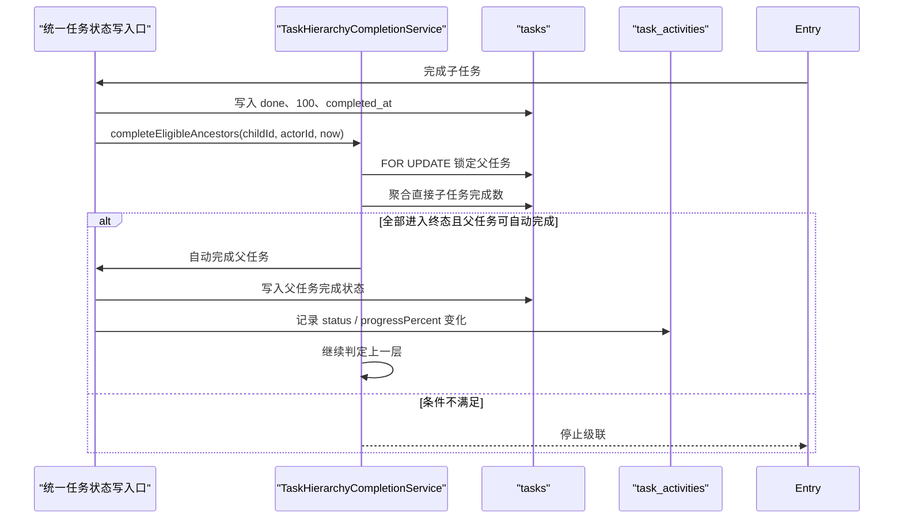

# 子任务全部完成后自动完成父任务

## 目标

当一个任务的全部直接子任务都进入终态后，后端在同一事务内将该父任务更新为 `done`，并沿父链继续级联，直到遇到不满足条件的祖先任务。

## 业务规则

1. 子任务终态统一定义为 `done`、`canceled`、`duplicate`；三种状态都计入“已完成子任务”。
2. 只统计直接子任务。多层任务通过逐级完成实现级联，不跨层聚合。
3. 父任务至少有一个直接子任务时才参与自动完成，避免空集合导致误完成。
4. 仅 `backlog`、`todo`、`in_progress`、`in_review` 状态的父任务可被自动更新；已为 `done` 时幂等跳过，`canceled`、`duplicate` 不被覆盖。
5. 自动完成统一写入 `status = done`、`progress_percent = 100`、`completed_at = 当前时间`。
6. 本能力只自动完成，不自动重开。之后新增、重开或迁入未完成子任务时，父任务保持当前状态，避免系统猜测用户期望恢复到哪个工作状态。

## 服务端设计

新增 `TaskHierarchyCompletionService`，作为父任务自动完成的唯一领域入口：

```java
List<TaskStateChange> completeEligibleAncestors(
    Long childTaskId,
    Long actorUserId,
    LocalDateTime occurredAt
)
```

处理流程：

1. 读取当前任务的 `parent_id`；为空则结束。
2. 使用 `SELECT ... FOR UPDATE` 锁定父任务。
3. 基于 `idx_tasks_parent_id` 执行一次聚合查询，得到该父任务的直接子任务总数和 `status IN ('done', 'canceled', 'duplicate')` 的终态数量。
4. 当 `total_count > 0 && terminal_count = total_count` 且父任务处于可自动完成状态时，通过统一任务状态写入口完成父任务。
5. 写入父任务的状态、进度、完成时间活动记录，并收集 `TaskStateChange`。
6. 将刚完成的父任务视为下一层子任务，继续处理其父任务；否则停止级联。

`TaskMapper` 增加两个精确查询：

- `selectByIdForUpdate(id)`：锁定待判断的父任务。
- `selectDirectChildCompletion(id)`：返回 `totalCount` 与按三种终态统计的 `terminalCount`。


批量导入先完成全部任务插入与父子关系写入，再从叶子到根按深度倒序调用自动完成入口。每个父任务在同一批处理中只判定一次。

## 调用链



## 并发与事务

- 子任务写入和祖先级联处于同一数据库事务，任一环节失败则整体回滚。
- 并发完成同一父任务下最后几个子任务时，各事务先写自己的子任务，再竞争父任务行锁。后获得锁的事务会读取前一事务已提交的子任务状态，因此不会漏掉最终完成。
- 父链始终按“当前父任务 → 更高层父任务”的固定方向加锁，避免反向锁顺序。
- 自动更新使用状态条件保护，只允许从四个开放状态转为 `done`，重复请求不会覆盖终态或制造重复状态变更。
- 单次操作的查询和更新量为 `O(任务层级深度)`，不扫描整棵任务树。

## API 与前端同步

任务创建和更新接口改为返回统一的 `TaskMutationResponse`：

```json
{
  "task": {},
  "autoCompletedAncestors": [
    {
      "id": 12,
      "taskKey": "ENG-12",
      "status": "done",
      "progressPercent": 100,
      "completedAt": "2026-07-28T10:30:00",
      "updatedAt": "2026-07-28T10:30:00"
    }
  ]
}
```

`autoCompletedAncestors` 按从近到远的父链顺序返回。前端 `taskStore` 在确认当前任务响应后，按 `taskKey` 合并这些服务端状态变更，并按 `done`、`canceled`、`duplicate` 三种终态重新计算受影响父任务的已完成子任务数。前端不自行判定或写入父任务完成状态，后端是唯一业务事实来源。


## 活动记录

自动完成沿用现有 `field_changed` 记录模型：

- `status`: 原状态 → `done`
- `progressPercent`: 原进度 → `100`（值实际变化时记录）


## 代码落点

- `linear-lite-server/.../service/TaskHierarchyCompletionService.java`：祖先判定与级联编排。
- `linear-lite-server/.../service/TaskStatusService.java`：任务状态、进度、完成时间的唯一写入口。
- `linear-lite-server/.../mapper/TaskMapper.java`：父任务行锁与直接子任务聚合查询。
- `linear-lite-server/.../service/TaskCommandService.java`：人工更新、创建及父子关系变化后触发级联。
- `linear-lite-server/.../service/TaskImportService.java`：导入建树后按深度触发级联。
- `linear-lite-server/.../dto/TaskMutationResponse.java`、`TaskStateChange.java`：返回当前任务及自动完成的祖先变更。
- `src/services/api/task.ts`、`src/store/taskStore.ts`：消费唯一响应结构并合并祖先状态。

本方案不新增数据库字段或索引，复用 `tasks.parent_id`、现有状态字段和 `idx_tasks_parent_id`。
