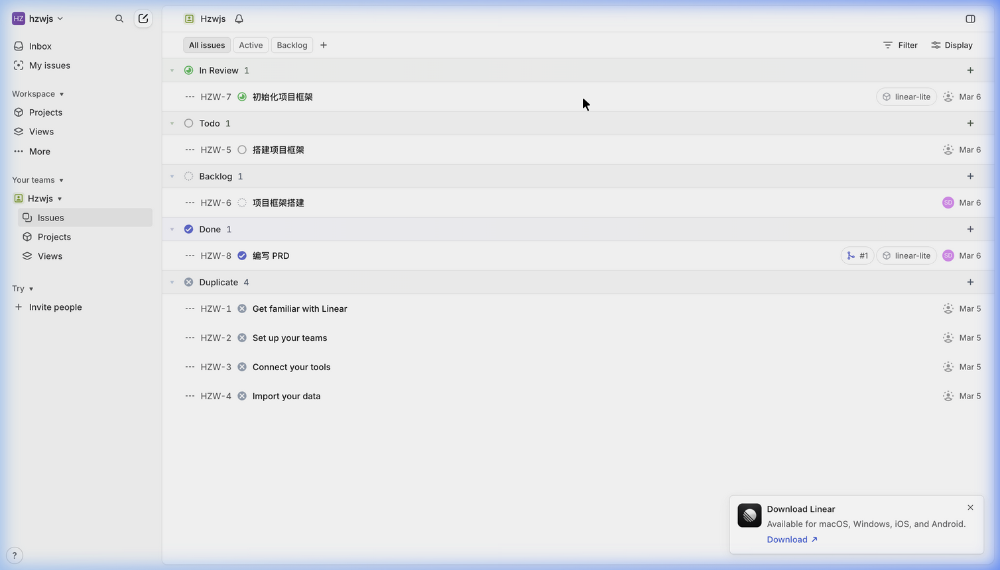
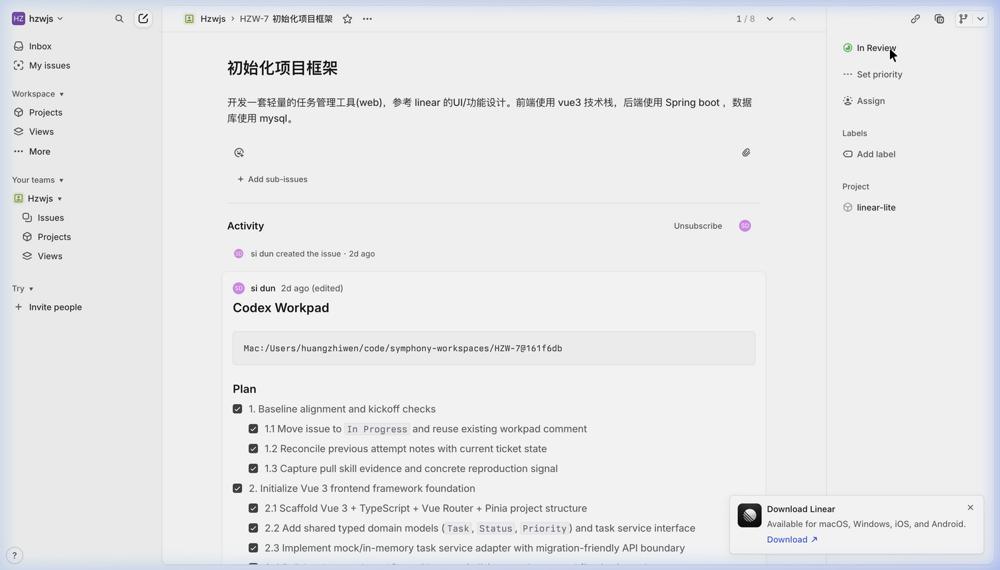

# Linear Lite - Phase 4 UI/UX 极致优化 (Premium Interface Polishing) 细化方案

## 核心定位与背景

Phase 3 已经打通了项目的底层骨架与业务流，Phase 4 的核心目标是：**像素级致敬 Linear.app 的质感、排版与微交互**。基于细致的走查对照，以下为具体到 Hex 色值、Px 像素和 Sprint 边界的落地执行方案。

> 截图参考:
> 
> 

---

## 1. 核心色彩与排印规范 (The Base Style)

### 精准色彩控制 (Palette - 仅浅色模式)

**决策**：Phase 4 本阶段仅专注实现 **浅色模式 (Light Theme)**。暗色模式的颜色仅作 CSS Variables 占位留白，延后实现。

- **页面主背景 (Main Bg)**: `#FFFFFF` (纯白，用于主任务列表区/主画布)
- **侧栏背景 (Sidebar Bg)**: `#F7F8F9` (形成极其微妙的空间切割)
- **主文本 (Text Primary)**: `#111827` (深炭灰)
- **副文本 (Text Secondary)**: `#6B7280` (用于 ID、日期等)
- **边框与分割 (Borders)**: `#E5E7EB` (全站模块切分统一使用 1px 细线)
- **Hover/Active 底色 (List Hover/Sidebar Active)**: `#F9FAFB` (极淡)
- **状态强特征色**: Done (`#5E6AD2` 标志蓝), In Progress (`#F2C94C` 预设黄), 强调警告 (`#E07373`)。

### 字体排印 (Typography)

- **Font Family**: 固定采用 `Inter, -apple-system, BlinkMacSystemFont, "Segoe UI", Roboto, Helvetica, Arial, sans-serif`。
- **字级层次**: 主体内容 `14px`，辅助/标签信息 `12px`。
- **微调参数**: 加载 `-webkit-font-smoothing: antialiased;` 与 `letter-spacing: -0.01em;`。

### 图标规范 (Iconography)

- **体系库**：采用 **Lucide** 线性风格图标库。
- **统一尺寸**：严格规范为 `16px` (辅助/行内状态) 和 `20px` (主操作面板) 两档。

---

## 2. 核心大框架解构与分栏模型 (Anatomy Refactoring)

### 摒弃「卡片悬浮」，采用「1px 线头切分画布」

当前界面过于依赖背景块+圆角阴影，造成「卡片浮在全局背景上」的撕裂感。

- **统一画布背景**：使看板主区域、侧栏和列表处于统一底层（仅有极弱的白-灰档次差）。
- **细线分割 (Border Dividers)**：列与列之间、表头与行之间，全部改用 `1px solid var(--color-border)` 作为主要视觉区隔。
- **看板去卡片化**：去掉看板栏目的独立圆角和厚重阴影，大幅收紧 `gap` 与 `padding`。单张卡片压低投影，看起来像贴在展板上的条子，而不是立体的块。

### 高密度列表视图 (List View) 与 Board 同步

- **极限高度压缩**: 行高 (Row Height) 锁定在 `40px - 44px`。
- **列布局与 Pills 映射 (关键改动)**：
  - **左侧**: [ 悬停显隐切换：平时显优先级图标 ↔ 鼠标移上去显勾选圈 ]
  - **中间**: 纯净且弹性宽度的标题 (Title)。
  - **右侧 Pills**: 原有的状态 (Status)、受派人 (24px 极小头像)、截止日期 (Due Date) 都不再作为表格的“列”存在，而是统一收拢为右尾部的胶囊药丸 (Pills)。隐去冗杂列头。
- **Board 看板新建与对齐**:
  - 每列列头增加 **"+" 快捷按钮**，点击即可在该列顶部插入并聚焦新建一条任务，消除因新建弹窗导致的上下文丢失。
  - 列头、卡片沿用新 CSS 色圈系统。操作与拖拽引入 `150ms ease` 丝滑对齐。

### 任务视图形态：从「全屏抽屉」进化为「同屏分栏」

- **形态替换 (P0 重点)**：当前固定全屏遮罩 + 右滑 640px Drawer 的方式破坏了视图沉浸感。我们将重塑为 **两栏式布局 (Left: List/Board | Right: Issue Details)**。
- 选定或新建 Issue 时，右侧即刻渲染任务详情面板，而左侧的主看板/列表**依然可见且维持滚动位置**。
- **消除全屏遮罩 (Background Dimming)**：绝对禁止使用深色遮罩强盖列表。右侧面板的物理边界由微妙的左边线或极清脆的高级阴影 (`0 10px 15px -3px rgba(0,0,0,0.1)...`) 构筑。
- **大标题文档流**：输入区域采用无边框的裸大点标题 textarea (`18-20px`, `font-weight: 600`)。
- **属性控制板 (Right Sidebar)**：右侧详情的各种下拉改用无外框的裸按钮 (触发自定义 Dropdowns)。

### 自定义可交互控件 (Dropdown & Date Picker)

**P0 级改造限制：全站绝对禁止使用原生 `<select>` 和原生 `<input type="date">`。**

- **无头下拉组件 (Custom Dropdown)**: 全部改写为 Popover，每个菜单项必须集成专属识别 Icon。
- **自定义日期选择 (Custom Date Picker)**: 强制采用自研/统一视觉风格的 DatePicker 挂载进 Popover，与 Dropdown 风格保持绝对像素一致。
- **无障碍与全键盘支持 (a11y)**: 高级应用的尊严。这些定制组件必须完美响应 Tab 焦点陷阱、方向键选择、Enter 确立，与 Esc 的无痛退出，充分适配 ARIA listbox 标准。

---

## 3. 极速命令与效率流转 (Commands & Speed)

- **命令面板 (Command Palette - ⌘K)**:
  - **支持范围**：新建任务、切换 Board/List 视图、打开项目设置、聚焦搜索框。
  - **焦点陷阱与 a11y**：呼出后劫持主页交互焦点，Esc 直接沉浸式关闭。
- **快捷键体系 (Keybindings)**:
  - `C`: 全局唤醒任务新建抽屉（如果 Palette 已打开则失效或行为等效化解冲突）。
  - `Esc`: 全局撤销/关闭最上层的面板或弹窗。

---

## 落地演进排期 (Phase 4 Tasks Sprints)

### Sprint 1: 门面与原生组件革新 (The Base)

_本期仅造轮子与奠基，不上任何重大的 DOM 结构的变动，避免返工。_

1. **全局 Variables 注入**：清洗现有的 CSS `var` 系统。替换字体栈 (Inter + 抗锯齿)，锁定浅色全局 hex（暗色先仅设为 CSS 占位变体，暂不深做）。导入 Lucide 图标集。
2. **底层 UI 套件**：彻底研发并封死 `<CustomSelect>` 和 `<CustomDatePicker>` 库（需兼备 a11y 键盘可用性）。
3. **视觉线条化**：将 List 每一行的 padding 和行高紧缩朝 40px 看齐。模态框去掉过于奔放的圆角和厚重浮影。

### Sprint 2: 同屏分栏改造与 Board 缝合 (The View)

_本期依托成熟组件，进行剧烈的视图结构破冰。_

1. **Task Detail 的“破墙行动” (两栏化)**：重筑当前的 `TaskEditor` 形态，彻底撕掉深浅遮罩 Overlay 面板。把它变成一条能优雅挤出/依附在主舞台右侧的边栏。其内部各种选型全部接通 Sprint 1 中的 CustomSelect。
2. **列表的 Pills 重排与隐现动画**：动大刀重排 ListView，把分散如表格的数据聚拢至右侧变为圆润胶囊形式 Pills；实现最左侧 (优先级图标/Checkbox) 的 Hover 流畅显隐。
3. **Board 视图缝合**：消除看板栏原本一块一块浮着的卡片背景，用 1px CSS 细线串联统一底层全背景板。在每列头增加内置的 `+` 新建任务入口。主菜单和卡片增加统筹的 `transition: 150ms ease;`。

### Sprint 3: 命令台降临 (The Power)

_在视觉完全趋同 Linear 后，打通操作的生死线。_

1. **极速指挥舱 (Command Palette ⌘K)**：集成能检索、且能控制路由新建和视图跳变的弹窗搜索舱 (a11y 焦点自持)。
2. **底层快捷操作网**：植下 `C` (召唤新建任务栏) 与 `Esc` (闭麦各种二级面板)。并在内部制定好命令防撞协议。
